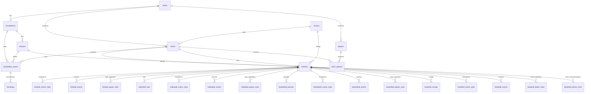
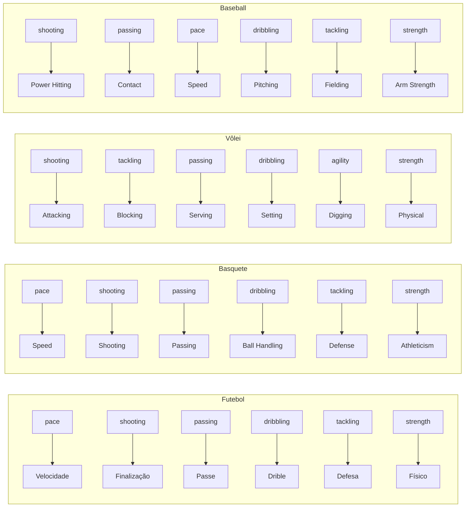

# MAP.md — Arquitetura do MoirAI Sports Engine

## Sistema

**Nome**: MoirAI Sports Engine
**Stack**: Next.js 14 + React 18 + TypeScript 5.4 + decimal.js
**Autor**: MADev
**Última Atualização**: 2026-05-27

---

## 📁 Estrutura de Arquivos

```
moirai-sports-engine/
├── app/
│   ├── layout.tsx              # Layout root com NavBar
│   ├── nav.tsx                 # Barra de navegação (Dashboard, Partidas, Atletas, Comparar, Scanner, Competições)
│   ├── globals.css             # Tailwind v3 + tema dark custom
│   ├── page.tsx                # Dashboard: stats, live matches, standings mini, scanner preview
│   ├── compare/
│   │   └── page.tsx            # Comparador de atletas: radar sobreposto + tabela diferenças
│   ├── matches/
│   │   ├── page.tsx            # Lista de partidas com filtros (all/scheduled/live/finished)
│   │   └── [id]/page.tsx       # Detalhe da partida + LiveMatchTracker (live), stats grid, player stats
│   ├── players/
│   │   ├── page.tsx            # Lista de atletas com busca e filtro por esporte
│   │   └── [id]/page.tsx       # Perfil do atleta com gráfico radar SVG, atributos, cartões
│   ├── scanner/
│   │   └── page.tsx            # Scanner ao vivo com thresholds (score mínimo, xG total)
│   ├── competitions/
│   │   └── page.tsx            # Tabela de classificação com seletores de competição/temporada
│   └── api/
│       ├── matches/route.ts    # GET: matches (filtro por id, status)
│       ├── players/route.ts    # GET: players (filtro por id, sport, q/search)
│       ├── competitions/route.ts # GET: listar; POST: standings
│       ├── scanner/route.ts    # GET: partidas escaneadas
│       └── standings/route.ts  # GET: classificação por competitionId + seasonId
├── components/
│   └── LiveMatchTracker.tsx    # Componente React de simulação ao vivo (742 linhas)
├── data/
│   └── seed.ts                 # Dados mockados: 5 comps, 20 times, 18 jogadores, 13 partidas, + stats, atributos, cartões + multi-sport (vôlei, basquete, baseball)
├── database/
│   ├── schema.sql              # Schema PostgreSQL completo (4 esportes, staff, lesões, transferências, tático, rankings, MV, partitioning)
│   └── migration_athletes.sql  # Perfil individual: atributos, cartões, teia
├── public/                     # Ativos estáticos (vazio)
├── services/
│   ├── predictionEngine.ts     # Motor preditivo baseado em Poisson (326 linhas)
│   └── scannerService.ts       # Scanner ao vivo e alertas (243 linhas)
├── types/
│   ├── sports.ts               # Contratos de dados do domínio (314 linhas)
│   └── database.ts             # Tipagens do banco de dados (839 linhas)
├── utils/
│   ├── mathEngine.ts           # Funções estatísticas puras (296 linhas)
│   └── financeEngine.ts        # EV e Critério de Kelly (149 linhas)
├── tailwind.config.ts          # Tema dark: sport-bg, sport-surface, sport-accent, etc.
├── postcss.config.mjs          # PostCSS: tailwindcss + autoprefixer
├── next.config.mjs             # Next.js 14 config
├── .gitignore
├── map.md
├── package.json
├── README.md
├── tsconfig.json
├── tsconfig.tsbuildinfo
└── next-env.d.ts
```

---

## 🏗️ Arquitetura

### Fluxo de Dados

```
[Seed Data (data/seed.ts)]
    │
    ├──► API Routes (app/api/*/route.ts)
    │       │
    │       ├──► [Navegador] GET /api/matches, /api/players, /api/competitions, /api/scanner, /api/standings
    │       │       │
    │       │       ▼
    │       │   Páginas Next.js (app/*/page.tsx)
    │       │       │
    │       │       ├── Dashboard (/) — cards de stats + últimas partidas + standings
    │       │       ├── Partidas (/matches) — lista filtrável
    │       │       ├── Detalhe Partida (/matches/[id]) — stats grid + LiveMatchTracker (se live)
    │       │       ├── Atletas (/players) — lista com busca
    │       │       ├── Perfil Atleta (/players/[id]) — radar SVG + atributos
    │       │       ├── Scanner (/scanner) — thresholds + resultados filtrados
    │       │       └── Competições (/competitions) — tabela de classificação
    │       │
    │       ▼
    │   [Futuro: Substituir seed por PostgreSQL real]
    │
[Simulação/Tick (LiveMatchTracker)]
    │
    ├──► predictLiveOutcome() ← Poisson
    │       │
    │       ├── calculateWinRates()
    │       ├── calculateFormScore()
    │       ├── calculateH2H()
    │       └── calculateGoalMetrics()
    │
    ├──► calculateExpectedValue()   ← EV
    ├──► calculateKellyCriterion()  ← Kelly
    │
    ▼
[Renderização: barras de prob, gráfico SVG, cards de stats, finanças]
```

### Camadas

| Camada                   | Responsabilidade                                   |
| ------------------------ | -------------------------------------------------- |
| **Data Layer**           | `data/seed.ts` — dados mockados (substituível por DB) |
| **API Layer**            | `app/api/*` — rotas Next.js servindo dados JSON    |
| **UI Layer (Pages)**     | `app/*/page.tsx` — páginas Next.js App Router      |
| **UI Layer (Component)** | `LiveMatchTracker.tsx` — renderização React        |
| **Prediction Layer**     | `predictionEngine.ts` — Poisson ao vivo            |
| **Scanner Layer**        | `scannerService.ts` — filtros + alertas            |
| **Math Layer**           | `mathEngine.ts` — estatísticas históricas          |
| **Finance Layer**        | `financeEngine.ts` — EV e Kelly                    |
| **Types Layer**          | `sports.ts` + `database.ts` — contratos de dados   |

---

## 📋 Componentes Principais

### 1. `LiveMatchTracker` (`components/LiveMatchTracker.tsx`)

**Responsabilidade**: Componente React `'use client'` que simula partidas ao vivo e exibe analytics em tempo real.

**Props**:
| Prop               | Tipo            | Descrição                      |
| ------------------ | --------------- | ------------------------------ |
| `match`            | `Match`         | Dados da partida               |
| `homeAvg`          | `GoalMetrics`   | Médias do time da casa         |
| `awayAvg`          | `GoalMetrics`   | Médias do time visitante       |
| `homeForm`         | `FormScoreResult` | Forma recente do time casa   |
| `awayForm`         | `FormScoreResult` | Forma recente do time visit. |
| `h2h`              | `H2HResult`     | Histórico de confrontos        |
| `initialBankroll`  | `number`        | Banca inicial                  |
| `odds`             | `BettingOdds`   | Odds atuais do mercado         |

**Estado Local**:
| Estado              | Tipo               | Descrição                          |
| ------------------- | ------------------ | ---------------------------------- |
| `minute`            | `number`           | Minuto atual da simulação (0-95)   |
| `analytics`         | `LiveAnalytics`    | Analytics gerados no tick          |
| `prediction`        | `PredictionResult` | Última predição calculada          |
| `ev`                | `EVResult`         | Expected Value atual               |
| `kelly`             | `KellyResult`      | Recomendação de Kelly              |
| `history`           | `DataPoint[]`      | Histórico de probabilidades (5/5)  |
| `isRunning`         | `boolean`          | Se a simulação está ativa          |

**Funções Internas**:
| Função                          | Descrição                                   |
| ------------------------------- | ------------------------------------------- |
| `generateSimulatedAnalytics()`  | Gera analytics sintéticos com variação      |
| `generateRandomEvent()`         | Simula eventos aleatórios (gols, cartões)   |
| `startSimulation()`             | Inicia o intervalo de tick (1s = 1 minuto)  |
| `stopSimulation()`              | Interrompe a simulação                      |

**Seções Visuais**:
- Header com times e minuto ao vivo
- Barra de probabilidades (casa/empate/fora)
- Gráfico SVG de evolução das probabilidades
- Cards de stats (posse, xG, ataques perigosos, gols projetados)
- Card de inteligência financeira (EV + Kelly)

---

### 2. Prediction Engine (`services/predictionEngine.ts`)

**Responsabilidade**: Motor preditivo baseado na Distribuição de Poisson para predição ao vivo.

**Constantes**:
| Constante                  | Valor | Descrição                                |
| -------------------------- | ----- | ---------------------------------------- |
| `RED_CARD_IMPACT`          | 0.35  | Redução de 35% no λ do time afetado      |
| `RED_CARD_BENEFIT`         | 1.25  | Aumento de 25% no λ do time beneficiado  |
| `DANGEROUS_ATTACK_FACTOR`  | 0.015 | Fator de ataque perigoso por minuto      |

**Funções Exportadas**:
| Função                    | Retorno            | Descrição                                    |
| ------------------------- | ------------------ | -------------------------------------------- |
| `predictLiveOutcome()`    | `PredictionResult` | Predição Poisson completa ao vivo            |
| `projectTotalGoals()`     | `number`           | Projeção ponderada de gols totais            |
| `adjustForLineups()`      | `LineupAdjustment` | Ajuste baseado em escalações (posições)      |

**Algoritmo `predictLiveOutcome()`**:
1. Estima λ (gols esperados) para casa/fora baseado em médias históricas, forma, H2H e tempo decorrido
2. Ajusta λ para cartões vermelhos
3. Ajusta λ para ataques perigosos acima da linha de base
4. Calcula matriz de Poisson (0-10 gols para cada time)
5. Soma probabilidades conjuntas: casa vence, empate, fora vence
6. Normaliza e atribui nível de confiança (`low` < 30min, `medium` 30-60min, `high` > 60min)

**Fatores de Impacto por Posição** (`adjustForLineups()`):
| Posição      | Peso  |
| ------------ | ----- |
| Goleiro      | 0.20  |
| Zagueiro     | 0.15  |
| Meio-campo   | 0.10  |
| Atacante     | 0.25  |

---

### 3. Scanner Service (`services/scannerService.ts`)

**Responsabilidade**: Sistema de varredura que filtra partidas ao vivo contra thresholds configuráveis e gera alertas formatados.

**Funções Exportadas**:
| Função                          | Retorno            | Descrição                              |
| ------------------------------- | ------------------ | -------------------------------------- |
| `liveScanner()`                 | `ScanResult`       | Filtra analytics contra thresholds     |
| `generateNotificationPayload()` | `NotificationPayload` | Cria payload formatado p/ webhook |

**Critérios de Filtro** (`ScannerThreshold`):
| Campo                    | Descrição                              |
| ------------------------ | -------------------------------------- |
| `minMinute`              | Minuto mínimo da partida               |
| `maxMinute`              | Minuto máximo da partida               |
| `maxGoalDifference`      | Diferença máxima de gols               |
| `minXgForTarget`         | xG mínimo para o time alvo             |
| `xTargetTeam`            | Time alvo (`home`, `away`, `either`)   |
| `minDangerousAttacks`    | Ataques perigosos mínimos (últ. 10min) |

---

### 4. Math Engine (`utils/mathEngine.ts`)

**Responsabilidade**: Funções estatísticas puras com precisão `decimal.js`.

**Funções Exportadas**:
| Função                  | Retorno           | Descrição                                |
| ----------------------- | ----------------- | ---------------------------------------- |
| `calculateWinRates()`   | `WinRates`        | % de vitórias/empates/derrotas           |
| `calculateFormScore()`  | `FormScoreResult` | Métrica ponderada (decai linearmente)    |
| `calculateH2H()`        | `H2HResult`       | Taxa de dominância caseira + média gols  |
| `calculateGoalMetrics()`| `GoalMetrics`     | Médias de gols + taxas Over/Under        |

---

### 5. Finance Engine (`utils/financeEngine.ts`)

---

## 📄 Páginas da Aplicação

### 1. Dashboard (`app/page.tsx`)

**Responsabilidade**: Tela inicial com visão geral do sistema.

**Componentes**:
- `StatCard` — 4 cards (Partidas, Ao Vivo, Scanner, Standings)
- `MatchCard` — cards de partidas (reutilizado em outras páginas)
- Tabela de classificação compacta (top 5)
- Preview do scanner

**Requisições**: `GET /api/matches`, `GET /api/standings`, `GET /api/scanner`

---

### 2. Lista de Partidas (`app/matches/page.tsx`)

**Responsabilidade**: Lista todas as partidas com filtro por status.

**Estado**: `filter` (all | scheduled | live | finished)

**Requisições**: `GET /api/matches`

---

### 3. Detalhe da Partida (`app/matches/[id]/page.tsx`)

**Responsabilidade**: Exibe detalhes completos de uma partida.

**Seções**:
- Header com placar, times, competição, árbitro, público
- Grid de 12 estatísticas (posse, chutes, xG, escanteios, faltas, cartões, passes, etc.)
- `LiveMatchTracker` (renderizado apenas se `status === 'live'`)
- Tabela de estatísticas individuais dos jogadores (gols, assists, passes, dribles, nota)

**Requisições**: `GET /api/matches?id={id}`

---

### 4. Lista de Atletas (`app/players/page.tsx`)

**Responsabilidade**: Lista atletas com busca textual e filtro por esporte.

**Componentes**:
- Input de busca + select de esporte
- Cards com nome, posição, overall, 5 atributos abreviados (RIT, FIN, PAS, DEF, FIS)

**Requisições**: `GET /api/players?sport={sport}&q={query}`

---

### 5. Perfil do Atleta (`app/players/[id]/page.tsx`)

**Responsabilidade**: Perfil completo com gráfico radar SVG.

**Seções**:
- Header: nome, posição, número, nacionalidade, altura, peso, pé preferido
- Gráfico radar SVG (6 eixos: Ritmo, Finalização, Passe, Defesa, Físico, Drible)
- Grid de 30+ atributos detalhados
- Lista de cartões disciplinares

**Componentes**:
- `RadarChart` — SVG puro (sem dependências), 5 níveis concêntricos, linhas radiais, área preenchida

**Requisições**: `GET /api/players?id={id}`

---

### 6. Scanner (`app/scanner/page.tsx`)

**Responsabilidade**: Interface do scanner ao vivo com thresholds configuráveis.

**Estado**: `minThresh` (score mínimo 0-10), `xgThresh` (xG total 0-5)

**Seções**:
- Painel de filtros com sliders
- Lista de resultados com match score, xG total, barra de progresso xG, badge de confiança

**Requisições**: `GET /api/scanner`

---

### 7. Competições (`app/competitions/page.tsx`)

**Responsabilidade**: Tabela de classificação com seletores de competição/temporada.

**Destaques visuais**:
- Borda lateral esquerda: azul (G4), verde (G6-Sudamericana), vermelho (Z4-rebaixamento)
- Colunas: #, Time, P, J, V, E, D, GP, GC, SG

**Requisições**: `POST /api/competitions` com `{ type: 'standings', competitionId, seasonId }`

---

## 🌐 API Routes

| Rota                           | Método | Parâmetros                                         | Descrição                                    |
| ------------------------------ | ------ | -------------------------------------------------- | -------------------------------------------- |
| `/api/matches`                 | GET    | `id`, `status`                                     | Lista/detalhe partidas                       |
| `/api/players`                 | GET    | `id`, `sport`, `q`                                 | Lista/detalhe atletas                        |
| `/api/competitions`            | GET    | `id`                                               | Lista competições                            |
| `/api/competitions`            | POST   | `{ type, competitionId, seasonId }`                | Classificação (standings)                    |
| `/api/scanner`                 | GET    | —                                                  | Partidas escaneadas                          |
| `/api/standings`               | GET    | `competitionId`, `seasonId`                        | Classificação                                |

---

**Responsabilidade**: Decisões financeiras baseadas em EV e Kelly.

**Funções Exportadas**:
| Função                      | Retorno         | Descrição                                    |
| --------------------------- | --------------- | -------------------------------------------- |
| `calculateExpectedValue()`  | `EVResult`      | EV = (prob_real * odd_decimal) - 1           |
| `calculateKellyCriterion()` | `KellyResult`   | Aposta ótima (Kelly fracionário, padrão 1/4) |

---

## 📊 Tipos do Domínio (`types/sports.ts`)

### Enums
| Enum               | Valores                                                    |
| ------------------ | ---------------------------------------------------------- |
| `MatchStatus`      | `scheduled`, `live`, `finished`, `postponed`, `cancelled`  |
| `PlayerPosition`   | `gk`, `def`, `mid`, `fwd`                                  |
| `CardType`         | `yellow`, `red`, `second_yellow`                           |
| `OverUnderLine`    | `1.5`, `2.5`, `3.5`, `4.5`                                 |
| `AlertStatus`      | `active`, `expired`, `triggered`                           |

### Interfaces Principais
| Interface              | Campos Principais                                    |
| ---------------------- | ---------------------------------------------------- |
| `Team`                 | `id`, `name`, `shortName`                            |
| `Match`                | `id`, `homeTeam`, `awayTeam`, `status`, `score`      |
| `Score`                | `home`, `away`                                       |
| `LiveAnalytics`        | `possession`, `expectedGoals`, `dangerousAttacks`...  |
| `LiveProbabilities`    | `homeWin`, `draw`, `awayWin`, `confidence`           |
| `ExpectedGoals`        | `homeXg`, `awayXg`, `xgPerMinute[]`                  |
| `BettingOdds`          | `homeWin`, `draw`, `awayWin`, `overUnder`            |
| `ScannerThreshold`     | `minMinute`, `maxMinute`, `minXgForTarget`...        |
| `NotificationPayload`  | `matchId`, `message`, `threshold`, `timestamp`       |
| `WebSocketMessage`     | União de todos os tipos de mensagem                  |

### Tipos Utilitários
| Tipo            | Descrição                           |
| --------------- | ----------------------------------- |
| `Either<A,B>`   | União de dois tipos                 |
| `Result<T,E>`   | Tipo resultado simplificado (monada)|

---

## 🔗 Fluxos Principais

### Fluxo 1: Simulação ao Vivo

```
1. Usuário abre a página com LiveMatchTracker
2. Componente recebe props (match, odds, stats históricos)
3. Usuário clica "Iniciar Simulação"
4. setInterval dispara a cada 1s (1 minuto de jogo)
5. generateSimulatedAnalytics() → analytics do tick
6. predictLiveOutcome(analytics, ...) → PredictionResult
7. calculateExpectedValue(prediction, odds) → EVResult
8. calculateKellyCriterion(EV, odds, bankroll) → KellyResult
9. history.push({ minute, home, draw, away })
10. Renderização atualiza: barra de prob, gráfico SVG, cards
11. Ao atingir 95', simulação para automaticamente
```

### Fluxo 2: Scanner de Partidas

```
1. liveScanner(analytics[], threshold) é chamado
2. Para cada partida ao vivo:
   a. Verifica se está dentro da janela de minutos
   b. Verifica diferença máxima de gols
   c. Verifica xG mínimo do time alvo
   d. Verifica ataques perigosos mínimos
   e. Calcula matchScore (0-1) ponderado
3. Retorna ScanResult ordenado por matchScore
4. Opcional: generateNotificationPayload() para webhook
```

### Fluxo 3: Decisão Financeira

```
1. PredictionResult chega do motor Poisson
2. calculateExpectedValue(prob_casa, odd_casa)
   → EV = 0.08 → isValueBet = true (8% de valor)
3. calculateKellyCriterion(EV, odd, banca)
   → fraction = 0.03 → R$ 30 em banca de R$ 1000
4. Cards exibem EV% com badge verde se value bet
   e recomendação de Kelly em R$ e %
```

---

## 🗄️ Banco de Dados (`database/schema.sql`)

### Modelo Entidade-Relacionamento



### Estrutura do Schema

O banco foi projetado em 3 camadas: **Domínio Compartilhado**, **Partidas** e **Esporte-Específico**.

#### Camada 1 — Domínio Compartilhado

| Tabela              | Descrição                                        |
| ------------------- | ------------------------------------------------ |
| `sports`            | Esportes suportados (futebol, vôlei, basquete, baseball) |
| `competitions`      | Ligas, copas, torneios                           |
| `seasons`           | Temporadas por competição (dados desde 2020)     |
| `venues`            | Estádios, ginásios, arenas                       |
| `teams`             | Times / clubes / seleções                        |
| `players`           | Atletas com metadata JSONB por esporte           |
| `team_players`      | Contratos/elenco por temporada                   |
| `competition_teams` | Times participantes por competição/temporada     |

#### Camada 2 — Partidas

| Tabela    | Descrição                                                  |
| --------- | ---------------------------------------------------------- |
| `matches` | Partidas com scores, status, árbitro, público, metadata    |

#### Camada 3 — Esporte-Específico

**Futebol:**
| Tabela                   | Descrição                                       |
| ------------------------ | ----------------------------------------------- |
| `football_match_stats`   | Posse, chutes, escanteios, laterais, faltas, cartões, xG, passes, dribles, desarmes, interceptações, cruzamentos |
| `football_events`        | Linha do tempo: gols (com assistência, tipo), cartões, substituições, coordenadas no campo |
| `football_player_stats`  | Estatísticas individuais por partida             |

**Vôlei:**
| Tabela                   | Descrição                                       |
| ------------------------ | ----------------------------------------------- |
| `volleyball_sets`        | Sets (1-5) com scores individuais               |
| `volleyball_match_stats` | Aces, bloqueios, ataques, kills, digs, assistências |
| `volleyball_events`      | Pontos por rotação e zona da quadra             |
| `volleyball_player_stats`| Estatísticas individuais por partida             |

**Basquete:**
| Tabela                   | Descrição                                       |
| ------------------------ | ----------------------------------------------- |
| `basketball_periods`     | Quartos, metades, prorrogações                  |
| `basketball_match_stats` | FG%, 3PT%, FT%, rebotes, assistências, steals, blocks, turnovers, fouls, fast-break, pontos no garrafão |
| `basketball_events`      | Arremessos (com zona, distância), rebotes, fouls, assistências |
| `basketball_player_stats`| Estatísticas individuais por partida             |

**Baseball:**
| Tabela                   | Descrição                                       |
| ------------------------ | ----------------------------------------------- |
| `baseball_innings`       | Innings com runs, hits, errors                  |
| `baseball_match_stats`   | Batting avg, OBP, slugging, pitches/strikes/balls |
| `baseball_events`        | Rebatidas (com exit velocity, launch angle), home runs, pitcher duels |
| `baseball_batter_stats`  | Estatísticas individuais de batedores           |
| `baseball_pitcher_stats` | Estatísticas individuais de arremessadores (ERA, WHIP) |

**Classificação:**
| Tabela       | Descrição                                       |
| ------------ | ----------------------------------------------- |
| `standings`  | Classificação flexível (qualquer esporte)        |

### Views

| View               | Descrição                                       |
| ------------------ | ----------------------------------------------- |
| `v_match_schedule` | Calendário completo de partidas por competição  |
| `v_standings`      | Classificação com dados dos times                |

### Tipo de Dados por Esporte (metadata JSONB)

```typescript
// Football
{ "position": "forward", "preferred_foot": "right", "shirt_number": 9 }

// Volleyball
{ "position": "outside_hitter", "reach_cm": 345, "shirt_number": 7 }

// Basketball
{ "position": "point_guard", "wingspan_cm": 201, "jersey_number": 23 }

// Baseball
{ "primary_position": "pitcher", "batting_hand": "right", "throwing_hand": "right" }
```

---

## 🧑‍🤝‍🧑 Perfil Individual de Atletas (`database/migration_athletes.sql`)

### Cartões Disciplinares (`player_cards`)

Registro completo da carreira disciplinar do atleta em qualquer esporte:

| Coluna               | Tipo        | Descrição                                  |
| -------------------- | ----------- | ------------------------------------------ |
| `player_id`          | UUID FK     | Atleta                                     |
| `match_id`           | UUID FK     | Partida                                    |
| `team_id`            | UUID FK     | Time do atleta no momento                  |
| `card_type`          | enum        | `yellow`, `red`, `second_yellow`           |
| `severity`           | enum        | `soft`, `hard`, `violent`, `technical`, `professional` |
| `minute`             | SMALLINT    | Minuto do cartão                           |
| `reason`             | TEXT        | Motivo                                     |
| `suspension_matches` | SMALLINT    | Jogos de suspensão resultantes             |
| `fine_amount`        | DECIMAL     | Multa aplicada                             |

### Atributos do Atleta 0-100 (`player_attributes`)

Tabela com dezenas de colunas de 0-100 para gráfico **radar/teia de aranha**. Divididos em categorias:

| Categoria  | Atributos (0-100)                                                              |
| ---------- | ------------------------------------------------------------------------------ |
| **Físicos**  | `pace`, `acceleration`, `stamina`, `strength`, `agility`, `balance`, `jumping`, `reaction` |
| **Técnicos** | `dribbling`, `passing`, `shooting`, `finishing`, `long_shots`, `crossing`, `heading`, `marking`, `tackling`, `interceptions` |
| **Mentais**  | `vision`, `composure`, `positioning`, `decision_making`, `teamwork`, `leadership`, `aggression` |
| **Goleiro**  | `diving`, `handling`, `kicking`, `reflexes`                                    |
| **Extra**    | `extra_attributes` JSONB — atributos específicos de cada esporte              |

### Mapa de Atributos por Esporte (Gráfico Teia)

Cada esporte mapeia as colunas genéricas para seus 6 eixos principais:



### Views de Perfil

| View                              | Descrição                                          |
| --------------------------------- | -------------------------------------------------- |
| `v_player_radar`                  | Radar genérico com todos os eixos                  |
| `v_player_radar_football`         | 6 eixos (teia) + 12 eixos (completo) + stats goleiro |
| `v_player_radar_basketball`       | Speed, Shooting, Passing, Ball Handling, Defense, Athleticism |
| `v_player_radar_volleyball`       | Attacking, Blocking, Serving, Setting, Digging, Physical |
| `v_player_radar_baseball`         | Power Hitting, Contact, Speed, Pitching, Fielding, Arm Strength |
| `v_player_career_stats`           | Estatísticas acumuladas da carreira                |
| `v_player_profile`                | Perfil completo com atributos, cartões, time atual |

### Exemplo de Retorno da Teia (JSON)

```json
{
  "playerId": "uuid",
  "fullName": "Neymar Jr.",
  "age": 32,
  "heightCm": 175,
  "weightKg": 68,
  "position": "forward",
  "overall": 89,
  "spider_6": {
    "pace": 91,
    "shooting": 83,
    "passing": 85,
    "dribbling": 95,
    "defending": 30,
    "physical": 52
  },
  "spider_12": {
    "pace": 91,
    "shooting": 83,
    "passing": 85,
    "dribbling": 95,
    "defending": 30,
    "physical": 52,
    "stamina": 73,
    "vision": 88,
    "agility": 92,
    "acceleration": 94,
    "composure": 82,
    "leadership": 65
  }
}
```

---

| Medida                 | Implementação                          |
| ---------------------- | -------------------------------------- |
| **Strict TypeScript**  | `strict: true`, `noUncheckedIndexedAccess` |
| **Sem `any`**          | Política explícita no código           |
| **Precisão Decimal**   | `decimal.js` com 20 casas decimais     |
| **Componente Client**  | `'use client'` para estado interativo  |
| **Módulos puros**      | `mathEngine` e `financeEngine` sem副作用 |

---

## 🚧 Issues Conhecidos / Pendências

| Issue                                                     | Severidade | Arquivo                        | Descrição                                      |
| --------------------------------------------------------- | ---------- | ------------------------------ | ---------------------------------------------- |
| Sem conexão com dados reais (WebSocket/API)               | média      | `data/seed.ts`                 | Dados são mockados, não reais — migrar para PostgreSQL |
| Predição ao vivo usa dados simulados (`generateSimulatedAnalytics`) | média | `LiveMatchTracker.tsx`         | Substituir por WebSocket real                  |
| `.opencode/` contém skills de outro projeto               | baixa      | `.opencode/`                   | Diretório de AI skills não pertence ao projeto |
| Sem testes automatizados                                  | média      | —                              | Nenhum framework de teste configurado          |
| `LiveMatchTracker` usa estilos inline                     | baixa      | `LiveMatchTracker.tsx`         | Migrar para Tailwind classes                   |
| Scanner retorna dados mockados (Math.random)              | baixa      | `app/api/scanner/route.ts`     | Conectar a dados reais                         |

---

## 📐 Contratos JSONB (MOI-005)

Campos JSONB livres exigem validação na camada de aplicação (FastAPI/Pydantic):

| Tabela | Coluna | Chaves esperadas |
|--------|--------|------------------|
| `players.metadata` | `metadata` | `{ position, preferred_foot/shirt_number (football) \| reach_cm (volleyball) \| wingspan_cm (basketball) \| primary_position/batting_hand (baseball) }` |
| `matches.metadata` | `metadata` | `{ weather, referee_team, tv_channel, attendance_breakdown }` |
| `standings.extra_stats` | `extra_stats` | `{ form (string[]), streak (string), home_record, away_record }` |
| `transfers.add_ons` | `add_ons` | `{ appearances_bonus, goals_bonus, promotion_clause, international_cap_bonus }` |
| `match_lineups.tactics` | `tactics` | `{ style (string), pressing_intensity (1-10), defensive_line, build_up_play, set_pieces }` |
| `odds.over_under` | `over_under` | `{ "2.5": { over, under }, "3.5": { over, under } }` |
| `odds.both_teams_score` | `both_teams_score` | `{ yes, no }` |
| `odds.asian_handicap` | `asian_handicap` | `{ "-1.5": { home, away }, "+0.5": { home, away } }` |
| `media_assets.metadata` | `metadata` | `{ copyright, photographer, source_url, dominant_color }` |
| `rankings.metadata` | `metadata` | `{ points, season, trend, previous_position }` |
| `players.metadata` | `extra_attributes` | `{ weak_foot, skill_moves, injury_prone, consistency }` |

## 🎯 Itens Estratégicos (MOI-008/009/010)

### MOI-008 — GenAI Readiness (OPPORTUNITY)
O schema atual já fornece 80% dos dados necessários para treinar LLMs esportivos:
- Views consolidadas (`v_player_profile`, `v_player_career_stats`) como fonte para RAG
- Eventos em timeline (`football_events`) para geração de crônicas e narrações automáticas
- Materialized Views (`mv_top_scorers`, `mv_team_recent_form`) para scout reports
- Próximo passo: pipeline de prompt engineering + fine-tuning com dados históricos

### MOI-009 — Big Data & Streaming (HIGH)
O volume de eventos em tempo real saturará o modelo puramente relacional:
- **CQRS**: separar writes (PostgreSQL transacional) de reads (Materialized Views + cache)
- **Event Sourcing**: eventos de partida como fonte da verdade, não apenas log
- **TimescaleDB** para dados temporais de eventos (hypertables com chunking automático)
- **ClickHouse** para analytics pesados (consolidado de player_stats por temporada)
- **Kafka/Redis Streams** para ingestão de dados ao vivo

### MOI-010 — Arquitetura Alvo (4 Camadas)
```
┌──────────────────────────────────────────────────────────────┐
│  moirai-core    → PostgreSQL (transacional)                  │
│                  matches, players, teams, standings, odds    │
├──────────────────────────────────────────────────────────────┤
│  moirai-live    → Redis (cache + pub/sub) + WebSocket       │
│                  eventos ao vivo, odds em tempo real         │
├──────────────────────────────────────────────────────────────┤
│  moirai-analytics → ClickHouse (OLAP) + Materialized Views  │
│                    MV, SCD Type 2, rankings, scout reports  │
├──────────────────────────────────────────────────────────────┤
│  moirai-ai      → LLM + RAG + TensorFlow/PyTorch            │
│                  predição Poisson, scouting IA, risco lesão  │
└──────────────────────────────────────────────────────────────┘
```

## 📝 CHANGELOG

### 2026-05-27 (v5)

- **MOI-001 (CRITICAL)**: Circular DDL corrigida — `match_lineups` movida para depois de `matches`
- **MOI-002 (CRITICAL)**: `player_attributes` restaurada no schema.sql com todos os 30+ atributos, índices e SCD Type 2
- **MOI-003 (HIGH)**: Auditoria Enterprise adicionada: `created_by UUID`, `updated_by UUID`, `deleted_at TIMESTAMPTZ` em `matches`, `transfers`, `standings`, `team_players`, `match_lineups`, `football_player_stats`
- **MOI-004 (HIGH)**: SCD Type 2 implementado: `valid_from`/`valid_to` em `rankings`, `player_attributes`, `standings`
- **MOI-006 (HIGH)**: `media_assets` adicionada — tabela polimórfica para imagens, logos, vídeos, streams (entity_type/entity_id)
- **MOI-007 (MEDIUM)**: `odds` adicionada — odds por bookmaker, over/under, both_teams_score, asian_handicap, margem, probabilidade implícita
- **Índices**: `idx_football_stats_player`, `idx_team_players_team_season` posicionados corretamente após suas tabelas
- **Seed**: `mediaAssetsData` (4), `oddsData` (3)
- **MOI-005 (MEDIUM)**: Contratos JSONB documentados para todos os 11 campos com chaves esperadas
- **MOI-008 (OPPORTUNITY)**: GenAI readiness documentado — views + eventos + MVs como fonte para LLMs
- **MOI-009 (HIGH)**: Estratégia de Big Data — CQRS, Event Sourcing, TimescaleDB, ClickHouse, Kafka
- **MOI-010 (STRATEGIC)**: Arquitetura alvo em 4 camadas (core, live, analytics, ai)
- **Types**: Interfaces `MediaAsset`, `Odds` + audit fields em interfaces existentes

### 2026-05-27 (v4)

- **ENUMs adicionados**: `transfer_type`, `injury_severity`, `ranking_type`, `staff_role`
- **Staff/Comissão Técnica**: tabelas `staff` + `team_staff` (técnicos, auxiliares, preparadores, scouts, analistas, fisioterapeutas)
- **Lesões**: tabela `player_injuries` com tipo, gravidade, parte do corpo, data de retorno, jogos perdidos
- **Transferências**: tabela `transfers` com valor, tipo (permanente/empréstimo/livre), cláusula de mais-valia, add-ons
- **Sistema Tático**: tabelas `match_lineups` (formação, técnico, táticas) + `lineup_players` (posição X/Y, capitão, titular)
- **Ranking Global**: tabela `rankings` flexível (jogador/time/competição por tipo de ranking com score)
- **Materialized Views**: `mv_top_scorers` (artilheiros), `mv_standings_enhanced` (aproveitamento %), `mv_team_recent_form` (últimos 5 jogos em JSON)
- **Índices novos**: `idx_matches_live` (partial), `idx_team_players_team_season`, `idx_player_attributes_player`, `idx_football_stats_player`
- **Partitioning**: nota/documentação para particionar tabelas de alta volumetria por RANGE (created_at)
- **Seed data expandido**: staff, team_staff, injuries, transfers, lineups, lineup_players, rankings
- **TypeScript**: interfaces novas `Staff`, `TeamStaff`, `PlayerInjury`, `Transfer`, `MatchLineup`, `LineupPlayer`, `Ranking`

### 2026-05-26 (v2)

- **7 páginas criadas**: Dashboard, Partidas, Detalhe Partida, Atletas, Perfil Atleta, Scanner, Competições
- **5 API routes criadas**: `/api/matches`, `/api/players`, `/api/competitions`, `/api/scanner`, `/api/standings`
- **Seed data** (`data/seed.ts`): 5 competições, 12 times brasileiros, 10 jogadores, 10 partidas (2020-2025), matchStats, playerStats, playerAttributes, playerCards, standings
- **Layout**: NavBar com navegação entre páginas + tema dark via Tailwind
- **Radar Chart**: Componente SVG puro (sem dependências) em `app/players/[id]/page.tsx`
- **LiveMatchTracker** integrado à página `/matches/[id]` para partidas ao vivo
- **Grade de 12 estatísticas** por partida (posse, xG, chutes, passes, cartões, etc.)
- **Tailwind CSS v3**: `tailwind.config.ts` com tema esportivo customizado (`sport-bg`, `sport-surface`, `sport-accent`, etc.)
- **Scanner UI**: sliders de threshold (score mínimo 0-10, xG total 0-5) com resultados em tempo real
- **Tabela de classificação**: destaques visuais (G4 azul, G6 verde, Z4 vermelho)
- **Build limpo**: `next build` compila sem erros (13 rotas, 0 warnings)

### 2026-05-26 (v1)

- Criação do mapeamento completo da arquitetura (`map.md`)
- Documentação da estrutura de diretórios, fluxos e tipos
- Identificação de issues conhecidas
- Correção de 5 erros de TypeScript:
  - `PlayerPosition` importado como valor (não tipo) em `predictionEngine.ts`
  - Variável `kDec` não utilizada removida em `predictionEngine.ts`
  - `ProbabilityBar` corrigido para usar interface própria com props corretas
  - Parâmetros não utilizados prefixados com `_` em `LiveMatchTracker.tsx`
  - Variável `pressingTeam` não utilizada removida em `scannerService.ts`
- Criação do schema de banco de dados PostgreSQL (`database/schema.sql`)
- Criação das tipagens TypeScript do banco (`types/database.ts`)
- Criação do perfil individual de atletas (`database/migration_athletes.sql`)
- Tipagens TypeScript: `PlayerCard`, `PlayerAttributes`, `PlayerRadarFootball`, `PlayerRadarBasketball`, `PlayerRadarVolleyball`, `PlayerRadarBaseball`, `PlayerProfile`

### 1.0.0

- Implementação inicial do motor de predição Poisson
- Implementação do scanner ao vivo com thresholds configuráveis
- Implementação do motor de estatísticas históricas
- Implementação do módulo financeiro (EV + Kelly)
- Componente LiveMatchTracker com simulação tick-a-tick
- Sistema de tipos completo sem `any`
