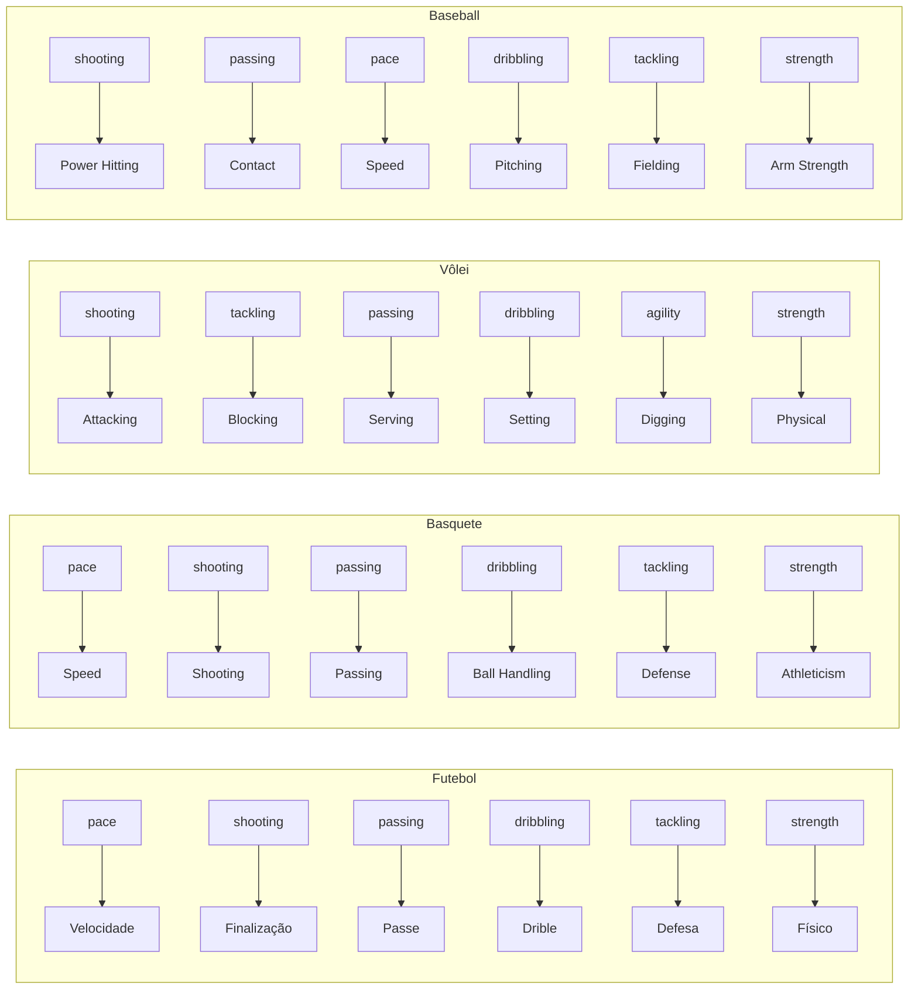

# MAP.md — Arquitetura do MoirAI Sports Engine

## Sistema

**Nome**: MoirAI Sports Engine / MoirAI Sports OS
**Stack**: Next.js 14 + React 18 + TypeScript 5.4 + decimal.js
**Autor**: MADev
**Última Atualização**: 2026-05-27
**Blueprint**: v0.3.5-Release · Reactive-Microservices-EDA

---

## 🏗️ Arquitetura 5 Camadas (v0.3.5)

```
┌─────────────────────────────────────────────────────────────┐
│  L5 — OLAP Analytics     ClickHouse                         │
│  Massive CV tracking, passing networks, tactical matrices   │
├─────────────────────────────────────────────────────────────┤
│  L4 — Time-Series        TimescaleDB                        │
│  Hypertables, colunar compression (7d), retenção (60d)      │
├─────────────────────────────────────────────────────────────┤
│  L3 — Hot Cache / PubSub   Redis Cluster                    │
│  live:match:{id}, live:timeline:{id}, Pub/Sub WS channels   │
├─────────────────────────────────────────────────────────────┤
│  L2 — Streaming           Kafka / Redpanda                  │
│  sports.events.raw → processed → snapshots → tracking       │
├─────────────────────────────────────────────────────────────┤
│  L1 — Operational DB      PostgreSQL + pgvector             │
│  ACID, RLS, entity_tenants, embeddings, Knowledge Graph     │
└─────────────────────────────────────────────────────────────┘
```

## 🔗 API Gateway (v0.3.5)

| Rota | Método | Fonte | Security |
|------|--------|-------|----------|
| `/api/v1/matches/live` | GET | Redis live:match:* | JWT + X-Tenant-ID |
| `/api/v1/ai/scouting-report` | POST | pgvector + Graph edges | JWT + X-Tenant-ID |
| `/api/live/match/{id}` | GET | Seed / Redis snapshots | X-Tenant-ID |

## 🔐 RBAC Enterprise (MOI-ADM)

### System Roles

| Role | Scope | Description |
|------|-------|-------------|
| `super_admin` | Global Infrastructure & Cross-Tenant | Full system access, infra config, tenant lifecycle |
| `global_manager` | Global Operational Monitoring | Platform administration, cross-tenant read |
| `tenant_admin` | Per-Tenant | Full control within a tenant boundary |
| `competition_manager` | Per-Competition | Competition config, match scheduling, standings |
| `scout` | Per-Tenant | Event creation/revision, player evaluation |
| `analyst` | Per-Tenant | Read + analytics dashboards, ML inference |
| `viewer` | Per-Tenant | Read-only access to assigned resources |

### Bootstrap Assignments

| User | Role | Scope |
|------|------|-------|
| Washington Meireles | `super_admin` | Global Infrastructure & Cross-Tenant Access |
| Diorgers Meireles | `global_manager` | Global Operational Monitoring & Platform Administration |

## 📡 Event Lifecycle Contract

```
sport_events_v3:
  event_sequence (BIGINT IDENTITY) → ordenamento monotônico global
  (id, version) PK → mutações pós-fato toleradas (VAR, scout)
  is_current + parent_event_id + revision_reason → audit trail

Core domain events:
  match.started | match.updated | match.finished | event.created
  snapshot.created | odds.updated | tracking.received
  player.injured | ranking.updated
```

---

## 📁 Estrutura de Arquivos

```
moirai-sports-engine/
├── app/
│   ├── layout.tsx              # Layout root com NavBar
│   ├── nav.tsx                 # Barra de navegação (Dashboard, Partidas, Atletas, Comparar, Scanner, Competições, Lendas, Dream Team, Admin)
│   ├── globals.css             # Tailwind v3 + tema dark custom
│   ├── page.tsx                # Dashboard: stats, live matches, standings mini, scanner preview
│   ├── compare/
│   │   └── page.tsx            # Comparador de atletas: radar sobreposto + tabela diferenças
│   ├── matches/
│   │   ├── page.tsx            # Lista de partidas com filtros (all/scheduled/live/finished)
│   │   └── [id]/page.tsx       # Detalhe da partida + LiveMatchTracker (live), stats grid, player stats
│   ├── players/
│   │   ├── page.tsx            # Lista de atletas com busca e filtro por esporte
│   │   └── [id]/page.tsx       # Perfil do atleta com gráfico radar SVG, atributos, cartões
│   ├── scanner/
│   │   └── page.tsx            # Scanner ao vivo com thresholds (score mínimo, xG total)
│   ├── competitions/
│   │   └── page.tsx            # Tabela de classificação com seletores de competição/temporada
│   ├── legends/
│   │   └── page.tsx            # Galeria de lendas do esporte com filtro por modalidade
│   └── dream-team/
│       └── page.tsx            # Construtor de Dream Team com campo tático e seleção de lendas
│   └── admin/
│       └── page.tsx            # Painel administrativo global: NOC, Quotas, Emergência, Compliance
├── api/
│   ├── matches/route.ts         # GET: matches (filtro por id, status)
│   ├── players/route.ts         # GET: players (filtro por id, sport, q/search)
│   ├── competitions/route.ts    # GET: listar; POST: standings
│   ├── scanner/route.ts         # GET: partidas escaneadas
│   ├── standings/route.ts       # GET: classificação por competitionId + seasonId
│   ├── legends/route.ts         # GET: lendas do esporte (filtro por sport)
│   ├── dream-teams/route.ts     # GET: listar dream teams; POST: criar dream team
│   ├── admin/route.ts           # GET: sys-health, quotas, audit; POST: purge, kill-switch, update-quota
│   ├── live/
│   │   └── match/[id]/route.ts  # GET: snapshot + gateway WebSocket fallback
│   └── v1/
│       ├── ai/
│       │   └── scouting-report/route.ts  # POST: similaridade vetorial + grafo
│       └── matches/
│           └── live/route.ts    # GET: partidas ao vivo (Redis pattern)
├── components/
│   ├── LiveMatchTracker.tsx    # Componente React de simulação ao vivo (693 linhas)
│   └── tactical/
│       └── SpatialPitchRender.tsx  # Canvas 25 FPS: atletas, bola, heatmap (MOI-LMCC)
├── data/
│   └── seed.ts                 # Dados mockados: 5 comps, 23 times, 28 jogadores (18 ativos + 10 lendas), 14 partidas, multi-sport stats, 7 atributos, 3 cartões + staff, injuries, transfers, lineups, rankings, odds, multi-tenant, embeddings, knowledge graph, ml features, audit logs, dream teams
├── database/
│   ├── schema.sql              # Schema PostgreSQL: 60 tabelas, 20 ENUMs, Knowledge Graph, ML Feature Store, Event Versioning, Audit & Governance, Dream Team, Fantasy Teams, Simulation Engine, Admin Panel, multi-tenant, embeddings, MV
│   ├── clickhouse_observability.sql     # ClickHouse DDL: MergeTree, MV, Kafka Engine, NOC queries
│   └── migration_athletes.sql  # Perfil individual: atributos, cartões, teia
├── hooks/
│   └── useMatchWebSocket.ts    # WebSocket resiliente com backoff exponencial (MOI-LMCC)
├── lib/
├── middleware/
│   ├── tenant_boundary.py  # FastAPI: valida X-Tenant-ID + alerta SOC em violação (MOI-SEC)
│   └── rbac_enforcer.py    # FastAPI: verifica system_role com bypass super_admin (MOI-SEC)
├── public/                     # Ativos estáticos (vazio)
├── services/
│   ├── predictionEngine.ts     # Motor preditivo baseado em Poisson (283 linhas)
│   └── scannerService.ts       # Scanner ao vivo e alertas (211 linhas)
├── store/
│   └── useLiveMatchStore.ts    # Zustand Slice Pattern: latência zero, 25 FPS (MOI-LMCC)
├── types/
│   ├── sports.ts               # Contratos de dados do domínio (279 linhas)
│   └── database.ts             # Tipagens do banco de dados (1450 linhas, 99 exports)
├── utils/
│   ├── mathEngine.ts           # Funções estatísticas puras (254 linhas)
│   └── financeEngine.ts        # EV e Critério de Kelly (133 linhas)
├── tailwind.config.ts          # Tema dark: sport-bg, sport-surface, sport-accent, etc.
├── postcss.config.mjs          # PostCSS: tailwindcss + autoprefixer
├── next.config.mjs             # Next.js 14 config
├── .gitignore
├── map.md
├── package.json
├── README.md
├── tsconfig.json
├── tsconfig.tsbuildinfo
└── next-env.d.ts
```

---

## 🏗️ Arquitetura

### Fluxo de Dados

```
[Seed Data (data/seed.ts)]
    │
    ├──► API Routes (app/api/*/route.ts)
    │       │
    │       ├──► [Navegador] GET /api/matches, /api/players, /api/competitions, /api/scanner, /api/standings
    │       │       │
    │       │       ▼
    │       │   Páginas Next.js (app/*/page.tsx)
    │       │       │
    │       │       ├── Dashboard (/) — cards de stats + últimas partidas + standings
    │       │       ├── Partidas (/matches) — lista filtrável
    │       │       ├── Detalhe Partida (/matches/[id]) — stats grid + LiveMatchTracker (se live)
    │       │       ├── Atletas (/players) — lista com busca
    │       │       ├── Perfil Atleta (/players/[id]) — radar SVG + atributos
    │       │       ├── Scanner (/scanner) — thresholds + resultados filtrados
    │       │       └── Competições (/competitions) — tabela de classificação
    │       │
    │       ▼
    │   [Futuro: Substituir seed por PostgreSQL real]
    │
[Simulação/Tick (LiveMatchTracker)]
    │
    ├──► predictLiveOutcome() ← Poisson
    │       │
    │       ├── calculateWinRates()
    │       ├── calculateFormScore()
    │       ├── calculateH2H()
    │       └── calculateGoalMetrics()
    │
    ├──► calculateExpectedValue()   ← EV
    ├──► calculateKellyCriterion()  ← Kelly
    │
    ▼
[Renderização: barras de prob, gráfico SVG, cards de stats, finanças]
```

### Camadas

| Camada                   | Responsabilidade                                   |
| ------------------------ | -------------------------------------------------- |
| **Data Layer**           | `data/seed.ts` — dados mockados (substituível por DB) |
| **API Layer**            | `app/api/*` — rotas Next.js servindo dados JSON    |
| **UI Layer (Pages)**     | `app/*/page.tsx` — páginas Next.js App Router      |
| **UI Layer (Component)** | `LiveMatchTracker.tsx` — renderização React        |
| **Prediction Layer**     | `predictionEngine.ts` — Poisson ao vivo            |
| **Scanner Layer**        | `scannerService.ts` — filtros + alertas            |
| **Math Layer**           | `mathEngine.ts` — estatísticas históricas          |
| **Finance Layer**        | `financeEngine.ts` — EV e Kelly                    |
| **Types Layer**          | `sports.ts` + `database.ts` — contratos de dados   |

---

## 📋 Componentes Principais

### 1. `LiveMatchTracker` (`components/LiveMatchTracker.tsx`)

**Responsabilidade**: Componente React `'use client'` que simula partidas ao vivo e exibe analytics em tempo real.

**Props**:
| Prop               | Tipo            | Descrição                      |
| ------------------ | --------------- | ------------------------------ |
| `match`            | `Match`         | Dados da partida               |
| `homeAvg`          | `GoalMetrics`   | Médias do time da casa         |
| `awayAvg`          | `GoalMetrics`   | Médias do time visitante       |
| `homeForm`         | `FormScoreResult` | Forma recente do time casa   |
| `awayForm`         | `FormScoreResult` | Forma recente do time visit. |
| `h2h`              | `H2HResult`     | Histórico de confrontos        |
| `initialBankroll`  | `number`        | Banca inicial                  |
| `odds`             | `BettingOdds`   | Odds atuais do mercado         |

**Estado Local**:
| Estado              | Tipo               | Descrição                          |
| ------------------- | ------------------ | ---------------------------------- |
| `minute`            | `number`           | Minuto atual da simulação (0-95)   |
| `analytics`         | `LiveAnalytics`    | Analytics gerados no tick          |
| `prediction`        | `PredictionResult` | Última predição calculada          |
| `ev`                | `EVResult`         | Expected Value atual               |
| `kelly`             | `KellyResult`      | Recomendação de Kelly              |
| `history`           | `DataPoint[]`      | Histórico de probabilidades (5/5)  |
| `isRunning`         | `boolean`          | Se a simulação está ativa          |

**Funções Internas**:
| Função                          | Descrição                                   |
| ------------------------------- | ------------------------------------------- |
| `generateSimulatedAnalytics()`  | Gera analytics sintéticos com variação      |
| `generateRandomEvent()`         | Simula eventos aleatórios (gols, cartões)   |
| `startSimulation()`             | Inicia o intervalo de tick (1s = 1 minuto)  |
| `stopSimulation()`              | Interrompe a simulação                      |

**Seções Visuais**:
- Header com times e minuto ao vivo
- Barra de probabilidades (casa/empate/fora)
- Gráfico SVG de evolução das probabilidades
- Cards de stats (posse, xG, ataques perigosos, gols projetados)
- Card de inteligência financeira (EV + Kelly)

---

### 2. Prediction Engine (`services/predictionEngine.ts`)

**Responsabilidade**: Motor preditivo baseado na Distribuição de Poisson para predição ao vivo.

**Constantes**:
| Constante                  | Valor | Descrição                                |
| -------------------------- | ----- | ---------------------------------------- |
| `RED_CARD_IMPACT`          | 0.35  | Redução de 35% no λ do time afetado      |
| `RED_CARD_BENEFIT`         | 1.25  | Aumento de 25% no λ do time beneficiado  |
| `DANGEROUS_ATTACK_FACTOR`  | 0.015 | Fator de ataque perigoso por minuto      |

**Funções Exportadas**:
| Função                    | Retorno            | Descrição                                    |
| ------------------------- | ------------------ | -------------------------------------------- |
| `predictLiveOutcome()`    | `PredictionResult` | Predição Poisson completa ao vivo            |
| `projectTotalGoals()`     | `number`           | Projeção ponderada de gols totais            |
| `adjustForLineups()`      | `LineupAdjustment` | Ajuste baseado em escalações (posições)      |

**Algoritmo `predictLiveOutcome()`**:
1. Estima λ (gols esperados) para casa/fora baseado em médias históricas, forma, H2H e tempo decorrido
2. Ajusta λ para cartões vermelhos
3. Ajusta λ para ataques perigosos acima da linha de base
4. Calcula matriz de Poisson (0-10 gols para cada time)
5. Soma probabilidades conjuntas: casa vence, empate, fora vence
6. Normaliza e atribui nível de confiança (`low` < 30min, `medium` 30-60min, `high` > 60min)

**Fatores de Impacto por Posição** (`adjustForLineups()`):
| Posição      | Peso  |
| ------------ | ----- |
| Goleiro      | 0.20  |
| Zagueiro     | 0.15  |
| Meio-campo   | 0.10  |
| Atacante     | 0.25  |

---

### 3. Scanner Service (`services/scannerService.ts`)

**Responsabilidade**: Sistema de varredura que filtra partidas ao vivo contra thresholds configuráveis e gera alertas formatados.

**Funções Exportadas**:
| Função                          | Retorno            | Descrição                              |
| ------------------------------- | ------------------ | -------------------------------------- |
| `liveScanner()`                 | `ScanResult`       | Filtra analytics contra thresholds     |
| `generateNotificationPayload()` | `NotificationPayload` | Cria payload formatado p/ webhook |

**Critérios de Filtro** (`ScannerThreshold`):
| Campo                    | Descrição                              |
| ------------------------ | -------------------------------------- |
| `minMinute`              | Minuto mínimo da partida               |
| `maxMinute`              | Minuto máximo da partida               |
| `maxGoalDifference`      | Diferença máxima de gols               |
| `minXgForTarget`         | xG mínimo para o time alvo             |
| `xTargetTeam`            | Time alvo (`home`, `away`, `either`)   |
| `minDangerousAttacks`    | Ataques perigosos mínimos (últ. 10min) |

---

### 4. Math Engine (`utils/mathEngine.ts`)

**Responsabilidade**: Funções estatísticas puras com precisão `decimal.js`.

**Funções Exportadas**:
| Função                  | Retorno           | Descrição                                |
| ----------------------- | ----------------- | ---------------------------------------- |
| `calculateWinRates()`   | `WinRates`        | % de vitórias/empates/derrotas           |
| `calculateFormScore()`  | `FormScoreResult` | Métrica ponderada (decai linearmente)    |
| `calculateH2H()`        | `H2HResult`       | Taxa de dominância caseira + média gols  |
| `calculateGoalMetrics()`| `GoalMetrics`     | Médias de gols + taxas Over/Under        |

---

### 5. Finance Engine (`utils/financeEngine.ts`)

---

## 📄 Páginas da Aplicação

### 1. Dashboard (`app/page.tsx`)

**Responsabilidade**: Tela inicial com visão geral do sistema.

**Componentes**:
- `StatCard` — 4 cards (Partidas, Ao Vivo, Scanner, Standings)
- `MatchCard` — cards de partidas (reutilizado em outras páginas)
- Tabela de classificação compacta (top 5)
- Preview do scanner

**Requisições**: `GET /api/matches`, `GET /api/standings`, `GET /api/scanner`

---

### 2. Lista de Partidas (`app/matches/page.tsx`)

**Responsabilidade**: Lista todas as partidas com filtro por status.

**Estado**: `filter` (all | scheduled | live | finished)

**Requisições**: `GET /api/matches`

---

### 3. Detalhe da Partida (`app/matches/[id]/page.tsx`)

**Responsabilidade**: Exibe detalhes completos de uma partida.

**Seções**:
- Header com placar, times, competição, árbitro, público
- Grid de 12 estatísticas (posse, chutes, xG, escanteios, faltas, cartões, passes, etc.)
- `LiveMatchTracker` (renderizado apenas se `status === 'live'`)
- Tabela de estatísticas individuais dos jogadores (gols, assists, passes, dribles, nota)

**Requisições**: `GET /api/matches?id={id}`

---

### 4. Lista de Atletas (`app/players/page.tsx`)

**Responsabilidade**: Lista atletas com busca textual e filtro por esporte.

**Componentes**:
- Input de busca + select de esporte
- Cards com nome, posição, overall, 5 atributos abreviados (RIT, FIN, PAS, DEF, FIS)

**Requisições**: `GET /api/players?sport={sport}&q={query}`

---

### 5. Perfil do Atleta (`app/players/[id]/page.tsx`)

**Responsabilidade**: Perfil completo com gráfico radar SVG.

**Seções**:
- Header: nome, posição, número, nacionalidade, altura, peso, pé preferido
- Gráfico radar SVG (6 eixos: Ritmo, Finalização, Passe, Defesa, Físico, Drible)
- Grid de 30+ atributos detalhados
- Lista de cartões disciplinares

**Componentes**:
- `RadarChart` — SVG puro (sem dependências), 5 níveis concêntricos, linhas radiais, área preenchida

**Requisições**: `GET /api/players?id={id}`

---

### 6. Scanner (`app/scanner/page.tsx`)

**Responsabilidade**: Interface do scanner ao vivo com thresholds configuráveis.

**Estado**: `minThresh` (score mínimo 0-10), `xgThresh` (xG total 0-5)

**Seções**:
- Painel de filtros com sliders
- Lista de resultados com match score, xG total, barra de progresso xG, badge de confiança

**Requisições**: `GET /api/scanner`

---

### 7. Competições (`app/competitions/page.tsx`)

**Responsabilidade**: Tabela de classificação com seletores de competição/temporada.

**Destaques visuais**:
- Borda lateral esquerda: azul (G4), verde (G6-Sudamericana), vermelho (Z4-rebaixamento)
- Colunas: #, Time, P, J, V, E, D, GP, GC, SG

**Requisições**: `POST /api/competitions` com `{ type: 'standings', competitionId, seasonId }`

---

## 🌐 API Routes

| Rota                           | Método | Parâmetros                                         | Descrição                                    |
| ------------------------------ | ------ | -------------------------------------------------- | -------------------------------------------- |
| `/api/matches`                 | GET    | `id`, `status`                                     | Lista/detalhe partidas                       |
| `/api/players`                 | GET    | `id`, `sport`, `q`                                 | Lista/detalhe atletas                        |
| `/api/competitions`            | GET    | `id`                                               | Lista competições                            |
| `/api/competitions`            | POST   | `{ type, competitionId, seasonId }`                | Classificação (standings)                    |
| `/api/scanner`                 | GET    | —                                                  | Partidas escaneadas                          |
| `/api/standings`               | GET    | `competitionId`, `seasonId`                        | Classificação                                |
| `/api/v1/matches/live`         | GET    | `tenant_id`, `sport_id`                            | Partidas ao vivo (Redis pattern)            |
| `/api/v1/ai/scouting-report`   | POST   | `{ player_id, compare_to }`                        | Relatório scout via pgvector + grafo        |
| `/api/live/match/{id}`         | GET    | Header `x-tenant-id`                               | Snapshot + histórico (WebSocket fallback)    |

---

**Responsabilidade**: Decisões financeiras baseadas em EV e Kelly.

**Funções Exportadas**:
| Função                      | Retorno         | Descrição                                    |
| --------------------------- | --------------- | -------------------------------------------- |
| `calculateExpectedValue()`  | `EVResult`      | EV = (prob_real * odd_decimal) - 1           |
| `calculateKellyCriterion()` | `KellyResult`   | Aposta ótima (Kelly fracionário, padrão 1/4) |

---

## 📊 Tipos do Domínio (`types/sports.ts`)

### Enums
| Enum               | Valores                                                    |
| ------------------ | ---------------------------------------------------------- |
| `MatchStatus`      | `scheduled`, `live`, `finished`, `postponed`, `cancelled`  |
| `PlayerPosition`   | `gk`, `def`, `mid`, `fwd`                                  |
| `CardType`         | `yellow`, `red`, `second_yellow`                           |
| `OverUnderLine`    | `1.5`, `2.5`, `3.5`, `4.5`                                 |
| `AlertStatus`      | `active`, `expired`, `triggered`                           |

### Interfaces Principais
| Interface              | Campos Principais                                    |
| ---------------------- | ---------------------------------------------------- |
| `Team`                 | `id`, `name`, `shortName`                            |
| `Match`                | `id`, `homeTeam`, `awayTeam`, `status`, `score`      |
| `Score`                | `home`, `away`                                       |
| `LiveAnalytics`        | `possession`, `expectedGoals`, `dangerousAttacks`...  |
| `LiveProbabilities`    | `homeWin`, `draw`, `awayWin`, `confidence`           |
| `ExpectedGoals`        | `homeXg`, `awayXg`, `xgPerMinute[]`                  |
| `BettingOdds`          | `homeWin`, `draw`, `awayWin`, `overUnder`            |
| `ScannerThreshold`     | `minMinute`, `maxMinute`, `minXgForTarget`...        |
| `NotificationPayload`  | `matchId`, `message`, `threshold`, `timestamp`       |
| `WebSocketMessage`     | União de todos os tipos de mensagem                  |

### Tipos Utilitários
| Tipo            | Descrição                           |
| --------------- | ----------------------------------- |
| `Either<A,B>`   | União de dois tipos                 |
| `Result<T,E>`   | Tipo resultado simplificado (monada)|

---

## 🔗 Fluxos Principais

### Fluxo 1: Simulação ao Vivo

```
1. Usuário abre a página com LiveMatchTracker
2. Componente recebe props (match, odds, stats históricos)
3. Usuário clica "Iniciar Simulação"
4. setInterval dispara a cada 1s (1 minuto de jogo)
5. generateSimulatedAnalytics() → analytics do tick
6. predictLiveOutcome(analytics, ...) → PredictionResult
7. calculateExpectedValue(prediction, odds) → EVResult
8. calculateKellyCriterion(EV, odds, bankroll) → KellyResult
9. history.push({ minute, home, draw, away })
10. Renderização atualiza: barra de prob, gráfico SVG, cards
11. Ao atingir 95', simulação para automaticamente
```

### Fluxo 2: Scanner de Partidas

```
1. liveScanner(analytics[], threshold) é chamado
2. Para cada partida ao vivo:
   a. Verifica se está dentro da janela de minutos
   b. Verifica diferença máxima de gols
   c. Verifica xG mínimo do time alvo
   d. Verifica ataques perigosos mínimos
   e. Calcula matchScore (0-1) ponderado
3. Retorna ScanResult ordenado por matchScore
4. Opcional: generateNotificationPayload() para webhook
```

### Fluxo 3: Decisão Financeira

```
1. PredictionResult chega do motor Poisson
2. calculateExpectedValue(prob_casa, odd_casa)
   → EV = 0.08 → isValueBet = true (8% de valor)
3. calculateKellyCriterion(EV, odd, banca)
   → fraction = 0.03 → R$ 30 em banca de R$ 1000
4. Cards exibem EV% com badge verde se value bet
   e recomendação de Kelly em R$ e %
```

---

## 🗄️ Banco de Dados (`database/schema.sql`)

### Modelo Entidade-Relacionamento

```mermaid
erDiagram
    sports ||--o{ competitions : "tem"
    sports ||--o{ teams : "classifica"
    sports ||--o{ players : "classifica"
    competitions ||--o{ seasons : "tem"
    competitions ||--o{ competition_teams : "inclui"
    seasons ||--o{ competition_teams : "define"
    seasons ||--o{ matches : "agrupa"
    teams ||--o{ competition_teams : "participa"
    teams ||--o{ matches : "casa"
    teams ||--o{ matches : "fora"
    teams ||--o{ team_players : "contrata"
    players ||--o{ team_players : "pertence"
    venues ||--o{ teams : "sede"
    venues ||--o{ matches : "abriga"

    matches ||--o{ football_match_stats : "estatisticas"
    matches ||--o{ football_events : "eventos"
    matches ||--o{ football_player_stats : "stats_jogadores"
    matches ||--o{ volleyball_sets : "sets"
    matches ||--o{ volleyball_match_stats : "estatisticas"
    matches ||--o{ volleyball_events : "eventos"
    matches ||--o{ volleyball_player_stats : "stats_jogadores"
    matches ||--o{ basketball_periods : "periodos"
    matches ||--o{ basketball_match_stats : "estatisticas"
    matches ||--o{ basketball_events : "eventos"
    matches ||--o{ basketball_player_stats : "stats_jogadores"
    matches ||--o{ baseball_innings : "innings"
    matches ||--o{ baseball_match_stats : "estatisticas"
    matches ||--o{ baseball_events : "eventos"
    competition_teams ||--o{ standings : "classificacao"
    players ||--o{ player_attributes : "atributos"
    players ||--o{ player_cards : "cartoes"
    players ||--o{ player_injuries : "lesoes"
    players ||--o{ transfers : "transferencias"
    staff ||--o{ team_staff : "contratos"
    teams ||--o{ team_staff : "comissao"
    organizations ||--o{ tenants : "organiza"
    tenants ||--o{ tenant_users : "usuarios"
    tenants ||--o{ tenant_permissions : "permissoes"
    tenants ||--o{ entity_tenants : "mapeia"
    tenants ||--o{ graph_nodes : "vertices"
    tenants ||--o{ audit_logs : "audita"
    graph_nodes ||--o{ graph_edges : "origem"
    graph_nodes ||--o{ graph_edges : "destino"
    matches ||--o{ match_state_snapshots : "snapshots"
    matches ||--o{ tracking_frames : "tracking"
    tracking_frames ||--o{ player_coordinates : "jogadores"
    tracking_frames ||--o{ ball_coordinates : "bola"
    matches ||--o{ sport_events : "eventos"
    matches ||--o{ sport_events_v3 : "eventos_v3"
```



### Estrutura do Schema

O banco foi projetado em 3 camadas: **Domínio Compartilhado**, **Partidas** e **Esporte-Específico**.

#### Camada 1 — Domínio Compartilhado

| Tabela              | Descrição                                        |
| ------------------- | ------------------------------------------------ |
| `sports`            | Esportes suportados (futebol, vôlei, basquete, baseball) |
| `competitions`      | Ligas, copas, torneios                           |
| `seasons`           | Temporadas por competição (dados desde 2020)     |
| `venues`            | Estádios, ginásios, arenas                       |
| `teams`             | Times / clubes / seleções                        |
| `players`           | Atletas com metadata JSONB por esporte           |
| `team_players`      | Contratos/elenco por temporada                   |
| `competition_teams` | Times participantes por competição/temporada     |

#### Camada 2 — Partidas

| Tabela    | Descrição                                                  |
| --------- | ---------------------------------------------------------- |
| `matches` | Partidas com scores, status, árbitro, público, metadata    |

#### Camada 3 — Esporte-Específico

**Futebol:**
| Tabela                   | Descrição                                       |
| ------------------------ | ----------------------------------------------- |
| `football_match_stats`   | Posse, chutes, escanteios, laterais, faltas, cartões, xG, passes, dribles, desarmes, interceptações, cruzamentos |
| `football_events`        | Linha do tempo: gols (com assistência, tipo), cartões, substituições, coordenadas no campo |
| `football_player_stats`  | Estatísticas individuais por partida             |

**Vôlei:**
| Tabela                   | Descrição                                       |
| ------------------------ | ----------------------------------------------- |
| `volleyball_sets`        | Sets (1-5) com scores individuais               |
| `volleyball_match_stats` | Aces, bloqueios, ataques, kills, digs, assistências |
| `volleyball_events`      | Pontos por rotação e zona da quadra             |
| `volleyball_player_stats`| Estatísticas individuais por partida             |

**Basquete:**
| Tabela                   | Descrição                                       |
| ------------------------ | ----------------------------------------------- |
| `basketball_periods`     | Quartos, metades, prorrogações                  |
| `basketball_match_stats` | FG%, 3PT%, FT%, rebotes, assistências, steals, blocks, turnovers, fouls, fast-break, pontos no garrafão |
| `basketball_events`      | Arremessos (com zona, distância), rebotes, fouls, assistências |
| `basketball_player_stats`| Estatísticas individuais por partida             |

**Baseball:**
| Tabela                   | Descrição                                       |
| ------------------------ | ----------------------------------------------- |
| `baseball_innings`       | Innings com runs, hits, errors                  |
| `baseball_match_stats`   | Batting avg, OBP, slugging, pitches/strikes/balls |
| `baseball_events`        | Rebatidas (com exit velocity, launch angle), home runs, pitcher duels |
| `baseball_batter_stats`  | Estatísticas individuais de batedores           |
| `baseball_pitcher_stats` | Estatísticas individuais de arremessadores (ERA, WHIP) |

**Classificação:**
| Tabela       | Descrição                                       |
| ------------ | ----------------------------------------------- |
| `standings`  | Classificação flexível (qualquer esporte)        |

**Governança & Auditoria (MOI-ADM):**
| Tabela       | Descrição                                       |
| ------------ | ----------------------------------------------- |
| `audit_logs` | Tamper-proof audit trail: actor_user_id, tenant_id, action, entity_type/entity_id, ip_address (INET), user_agent, metadata JSONB (diff state before/after), created_at — 4 índices forenses |

### Views

| View               | Descrição                                       |
| ------------------ | ----------------------------------------------- |
| `v_match_schedule` | Calendário completo de partidas por competição  |
| `v_standings`      | Classificação com dados dos times                |

### Tipo de Dados por Esporte (metadata JSONB)

```typescript
// Football
{ "position": "forward", "preferred_foot": "right", "shirt_number": 9 }

// Volleyball
{ "position": "outside_hitter", "reach_cm": 345, "shirt_number": 7 }

// Basketball
{ "position": "point_guard", "wingspan_cm": 201, "jersey_number": 23 }

// Baseball
{ "primary_position": "pitcher", "batting_hand": "right", "throwing_hand": "right" }
```

---

## 🧑‍🤝‍🧑 Perfil Individual de Atletas (`database/migration_athletes.sql`)

### Cartões Disciplinares (`player_cards`)

Registro completo da carreira disciplinar do atleta em qualquer esporte:

| Coluna               | Tipo        | Descrição                                  |
| -------------------- | ----------- | ------------------------------------------ |
| `player_id`          | UUID FK     | Atleta                                     |
| `match_id`           | UUID FK     | Partida                                    |
| `team_id`            | UUID FK     | Time do atleta no momento                  |
| `card_type`          | enum        | `yellow`, `red`, `second_yellow`           |
| `severity`           | enum        | `soft`, `hard`, `violent`, `technical`, `professional` |
| `minute`             | SMALLINT    | Minuto do cartão                           |
| `reason`             | TEXT        | Motivo                                     |
| `suspension_matches` | SMALLINT    | Jogos de suspensão resultantes             |
| `fine_amount`        | DECIMAL     | Multa aplicada                             |

### Atributos do Atleta 0-100 (`player_attributes`)

Tabela com dezenas de colunas de 0-100 para gráfico **radar/teia de aranha**. Divididos em categorias:

| Categoria  | Atributos (0-100)                                                              |
| ---------- | ------------------------------------------------------------------------------ |
| **Físicos**  | `pace`, `acceleration`, `stamina`, `strength`, `agility`, `balance`, `jumping`, `reaction` |
| **Técnicos** | `dribbling`, `passing`, `shooting`, `finishing`, `long_shots`, `crossing`, `heading`, `marking`, `tackling`, `interceptions` |
| **Mentais**  | `vision`, `composure`, `positioning`, `decision_making`, `teamwork`, `leadership`, `aggression` |
| **Goleiro**  | `diving`, `handling`, `kicking`, `reflexes`                                    |
| **Extra**    | `extra_attributes` JSONB — atributos específicos de cada esporte              |

### Mapa de Atributos por Esporte (Gráfico Teia)

Cada esporte mapeia as colunas genéricas para seus 6 eixos principais:



### Views de Perfil

| View                              | Descrição                                          |
| --------------------------------- | -------------------------------------------------- |
| `v_player_radar`                  | Radar genérico com todos os eixos                  |
| `v_player_radar_football`         | 6 eixos (teia) + 12 eixos (completo) + stats goleiro |
| `v_player_radar_basketball`       | Speed, Shooting, Passing, Ball Handling, Defense, Athleticism |
| `v_player_radar_volleyball`       | Attacking, Blocking, Serving, Setting, Digging, Physical |
| `v_player_radar_baseball`         | Power Hitting, Contact, Speed, Pitching, Fielding, Arm Strength |
| `v_player_career_stats`           | Estatísticas acumuladas da carreira                |
| `v_player_profile`                | Perfil completo com atributos, cartões, time atual |

**Nota**: As views de perfil estão documentadas como design de arquitetura mas ainda não foram implementadas em SQL.

---

## 📊 Tipos do Banco de Dados (`types/database.ts`)

### 22 Type Aliases (ENUMs + utils)

| Type Alias | Valores |
|---|---|
| `SportType` | `football`, `volleyball`, `basketball`, `baseball` |
| `MatchStatus` | `scheduled`, `live`, `finished`, `postponed`, `cancelled` |
| `MatchPeriod` | `first_half`, `second_half`, `extra_time`, `penalties` |
| `CardType` | `yellow`, `red`, `second_yellow` |
| `FootballEventType` | `goal`, `card`, `substitution`, `penalty`, `own_goal` |
| `VolleyballEventType` | `point`, `block`, `serve_ace`, `attack_error`, `substitution`, `timeout` |
| `BasketballEventType` | `two_pointer`, `three_pointer`, `free_throw`, `rebound`, `assist`, `steal`, `block`, `foul`, `turnover`, `substitution`, `timeout` |
| `BaseballEventType` | `hit`, `home_run`, `strikeout`, `walk`, `error`, `double_play`, `stolen_base`, `caught_stealing` |
| `FoulType` | `personal`, `technical`, `flagrant`, `offensive` |
| `GoalType` | `open_play`, `penalty`, `free_kick`, `corner`, `header`, `own_goal` |
| `TransferType` | `permanent`, `loan`, `free_transfer`, `swap`, `youth_promotion` |
| `InjurySeverity` | `minor`, `moderate`, `severe`, `career_threatening` |
| `RankingType` | `player_overall`, `team_form`, `top_scorer`, `top_assists`, `club_world`, `player_potential`, `club_ranking` |
| `StaffRole` | `head_coach`, `assistant_coach`, `fitness_coach`, `scout`, `analyst`, `physiotherapist`, `doctor`, `director_of_football`, `sporting_director` |
| `EntityType` | `player`, `team`, `match`, `competition`, `venue`, `scout_report`, `article` |
| `EdgePredicate` | `played_with`, `coached_by`, `rival_of`, `injured_in`, `transferred_to`, `agent_of`, `tactical_cluster` |
| `FeatureGroup` | `tactical`, `physical`, `psychological`, `performance`, `scouting` |
| `SystemRole` | `super_admin`, `global_manager`, `tenant_admin`, `competition_manager`, `scout`, `analyst`, `viewer` |
| `CardSeverity` | `soft`, `hard`, `violent`, `technical`, `professional` |

### 65 Interfaces (23 domínio + 11 analytics + 4 radar + 2 perfil + 13 SaaS/gov + 4 embedding/graph + 4 feature/event + 2 ML + 1 audit + 1 governance update)

| Categoria | Interfaces |
|---|---|
| **Domínio** | `Sport`, `Competition`, `Season`, `Venue`, `Team`, `CompetitionTeam`, `Player`, `TeamPlayer`, `Staff`, `TeamStaff`, `PlayerMetadata`, `PlayerInjury`, `Transfer`, `Match`, `Standing` |
| **Multi-Tenant** | `Organization`, `Tenant`, `TenantUser`, `TenantPermission`, `EntityTenant` |
| **Governance** | `AuditLog` |
| **Tático** | `MatchLineup`, `LineupPlayer` |
| **Ranking/Mídia/Odds** | `Ranking`, `MediaAsset`, `Odds` |
| **Live State** | `MatchStateSnapshot` |
| **Tracking** | `TrackingFrame`, `PlayerCoordinate`, `BallCoordinate` |
| **Eventos** | `SportEvent`, `SportEventV3` |
| **AI/Embeddings** | `EntityEmbedding`, `GraphNode`, `GraphEdge` |
| **ML Feature Store** | `MlFeature` |
| **Futebol** | `FootballMatchStats`, `FootballEvent`, `FootballPlayerStats` |
| **Vôlei** | `VolleyballSet`, `VolleyballMatchStats`, `VolleyballEvent`, `VolleyballPlayerStats` |
| **Basquete** | `BasketballPeriod`, `BasketballMatchStats`, `BasketballEvent`, `BasketballPlayerStats` |
| **Baseball** | `BaseballInning`, `BaseballMatchStats`, `BaseballEvent`, `BaseballBatterStats`, `BaseballPitcherStats` |
| **Disciplina** | `PlayerCard`, `PlayerAttributes` |
| **Radar** | `PlayerRadarAxis`, `PlayerRadarData`, `PlayerRadarFootball`, `PlayerRadarBasketball`, `PlayerRadarVolleyball`, `PlayerRadarBaseball` |
| **Perfil** | `PlayerProfile` |

---

### Exemplo de Retorno da Teia (JSON)

```json
{
  "playerId": "uuid",
  "fullName": "Neymar Jr.",
  "age": 32,
  "heightCm": 175,
  "weightKg": 68,
  "position": "forward",
  "overall": 89,
  "spider_6": {
    "pace": 91,
    "shooting": 83,
    "passing": 85,
    "dribbling": 95,
    "defending": 30,
    "physical": 52
  },
  "spider_12": {
    "pace": 91,
    "shooting": 83,
    "passing": 85,
    "dribbling": 95,
    "defending": 30,
    "physical": 52,
    "stamina": 73,
    "vision": 88,
    "agility": 92,
    "acceleration": 94,
    "composure": 82,
    "leadership": 65
  }
}
```

---

| Medida                 | Implementação                          |
| ---------------------- | -------------------------------------- |
| **Strict TypeScript**  | `strict: true`, `noUncheckedIndexedAccess` |
| **Sem `any`**          | Política explícita no código           |
| **Precisão Decimal**   | `decimal.js` com 20 casas decimais     |
| **Componente Client**  | `'use client'` para estado interativo  |
| **Módulos puros**      | `mathEngine` e `financeEngine` sem副作用 |

---

## 🏢 MoirAI Enterprise Dashboard & Governance Center (MOI-ADM)

### 7 Dashboard Modules

| Module | Concept | KPIs |
|--------|---------|------|
| **1 — Global Operations Center** | NOC-inspired trading terminal for cloud observability | live_matches_count, events_per_minute_throughput, websocket_connection_latency_ms, active_tenants_count, kafka_consumer_lag_offset, redis_cache_hit_ratio, api_gateway_requests_per_second, live_snapshots_per_second, failed_ingestion_jobs_count, data_providers_status_online |
| **2 — Tenant Governance Center** | SaaS multi-tenant commercial & resource administration | storage_allocation_per_tenant_bytes, estimated_infrastructure_cost_runrate, requests_per_minute_load, vector_embeddings_generated_count, websocket_egress_traffic_bandwidth |
| **3 — Live Match Command Center** | Reactive real-time tactical operation board | live_scores, instantaneous_event_ticker, match_chronological_timeline, offensive_pressure_index, momentum_graphing, live_xg, cv_heatmap, dynamic_possession, websocket_mesh_state |
| **4 — AI Analytics Center** | ML ops, vector serving & predictive analysis | active_embeddings_volume, ml_inference_throughput, deployed_models_lineage, data_drift_detection, model_accuracy_tracking, feature_store_pipeline_runs |
| **5 — Observability Infra** | SRE monitoring telemetry | cpu_utilization, ram_allocation, redis_memory_footprint, kafka_topic_lag, websocket_rtt_ms, database_row_locks, slow_query_logs, dead_letter_queues_dlq_status |
| **6 — Security & Audit Center** | Enterprise compliance & forensic logging | login_attempts_vector, active_jwt_sessions, rbac_unauthorized_violations, tenant_boundary_leakage_violations, api_abuse_patterns, rate_limiting_triggers, tamper_proof_audit_trail |
| **7 — Media Broadcast Control** | Multimedia ingestion & highlight automation | live_rtmp_srt_streams, automated_clip_generation, match_highlights_metadata, instant_replay_triggers, video_ingestion_pipelines, cv_tracking_timecode_sync |

### Frontend Stack Specification

| Layer | Technology |
|-------|-----------|
| Framework | Next.js (App Router) |
| Library | React |
| Styling | Tailwind CSS |
| UI Components | shadcn/ui |
| Charting Engine | Apache ECharts |
| Real-time Networking | Native WebSocket Gateway client |
| State Management | Zustand (Slice pattern for low-latency) |
| Geospatial | Mapbox GL / deck.gl |
| Advanced Sports Viz | realtime spatial heatmaps, player biometric radar charts, interactive tactical boards, dynamic passing networks, spatial tracking overlays (Canvas) |

---

## 🎮 LiveMatchCommandCenter (MOI-LMCC)

### Architecture
```
useMatchWebSocket (hook)
  └─ WebSocket → ws://gateway/live/match/{id}?tenant_id={tid}
       ├─ tracking_frame → setLiveFrame(frame)  [Zustand]
       └─ other event    → pushEvent(event)     [Zustand]
                              └─ eventTicker (last 50)
SpatialPitchRender (Canvas 800×500)
  └─ useLiveMatchStore → spatialCoordinates
       ├─ players[] → circle per athlete (home=#1d4ed8, away=#b91c1c)
       └─ ball      → circle with Z-axis radius boost
```

### Rate Limiting (MoirAISecurityGateway)

| Tier | rpm | Burst | Action |
|------|-----|-------|--------|
| standard | 60 | 5 | HTTP 429 |
| enterprise_club | 1200 | 50 | HTTP 429 |
| betting_provider | 10000 | 500 | HTTP 429 |

### RBAC Enforcement Chain
```
Request → tenant_boundary.py (X-Tenant-ID + Redis SISMEMBER)
        → rbac_enforcer.py (system_role check, super_admin bypass)
        → log_security_violation() on boundary breach → audit_logs
```

---

## 🏗️ ClickHouse Observability Engine (MOI-CH)

### Tables

| Table | Engine | Purpose | TTL |
|-------|--------|---------|-----|
| `api_network_metrics` | MergeTree | Raw API gateway logs | 30 days |
| `mv_api_network_performance_minutely` | SummingMergeTree | Per-minute aggregates by tenant+endpoint | — |
| `websocket_telemetry_metrics` | ReplacingMergeTree | WS connection/throughput telemetry | 14 days |
| `kafka_network_ingress_queue` | Kafka | Direct Kafka consumer (JSONEachRow) | — |

### Data Flow
```
Kafka (moirai.infra.network.logs)
  └─ kafka_network_ingress_queue (Kafka Engine)
       └─ kafka_network_ingress_mv (MV)
            └─ api_network_metrics (MergeTree)
                 └─ v_api_network_performance_minutely_mv (MV)
                      └─ mv_api_network_performance_minutely (SummingMergeTree)
```

---

## 🚧 Issues Conhecidos / Pendências

| Issue                                                     | Severidade | Arquivo                        | Descrição                                      |
| --------------------------------------------------------- | ---------- | ------------------------------ | ---------------------------------------------- |
| Sem conexão com dados reais (WebSocket/API)               | média      | `data/seed.ts`                 | Dados são mockados, não reais — migrar para PostgreSQL |
| Predição ao vivo usa dados simulados (`generateSimulatedAnalytics`) | média | `LiveMatchTracker.tsx`         | Substituir por WebSocket real                  |
| Views de perfil de atleta não implementadas em SQL        | baixa      | `database/migration_athletes.sql` | `v_player_radar*`, `v_player_profile`, `v_player_career_stats` só existem como design |
| Sem testes automatizados                                  | média      | —                              | Nenhum framework de teste configurado          |
| `LiveMatchTracker` usa estilos inline                     | baixa      | `LiveMatchTracker.tsx`         | Migrar para Tailwind classes                   |
| Scanner retorna dados mockados (Math.random)              | baixa      | `app/api/scanner/route.ts`     | Conectar a dados reais                         |
| `types/database.ts` com 63 interfaces sem barrel export   | baixa      | `types/database.ts`            | Falta `index.ts` para importações organizadas  |

---

## 📐 Contratos JSONB (MOI-005)

Campos JSONB livres exigem validação na camada de aplicação (FastAPI/Pydantic):

| Tabela | Coluna | Chaves esperadas |
|--------|--------|------------------|
| `players.metadata` | `metadata` | `{ position, preferred_foot/shirt_number (football) \| reach_cm (volleyball) \| wingspan_cm (basketball) \| primary_position/batting_hand (baseball) }` |
| `matches.metadata` | `metadata` | `{ weather, referee_team, tv_channel, attendance_breakdown }` |
| `standings.extra_stats` | `extra_stats` | `{ form (string[]), streak (string), home_record, away_record }` |
| `transfers.add_ons` | `add_ons` | `{ appearances_bonus, goals_bonus, promotion_clause, international_cap_bonus }` |
| `match_lineups.tactics` | `tactics` | `{ style (string), pressing_intensity (1-10), defensive_line, build_up_play, set_pieces }` |
| `odds.over_under` | `over_under` | `{ "2.5": { over, under }, "3.5": { over, under } }` |
| `odds.both_teams_score` | `both_teams_score` | `{ yes, no }` |
| `odds.asian_handicap` | `asian_handicap` | `{ "-1.5": { home, away }, "+0.5": { home, away } }` |
| `media_assets.metadata` | `metadata` | `{ copyright, photographer, source_url, dominant_color }` |
| `rankings.metadata` | `metadata` | `{ points, season, trend, previous_position }` |
| `players.metadata` | `extra_attributes` | `{ weak_foot, skill_moves, injury_prone, consistency }` |

## 🎯 Itens Estratégicos (MOI-008/009/010)

### MOI-008 — GenAI Readiness (OPPORTUNITY)
O schema atual já fornece 80% dos dados necessários para treinar LLMs esportivos:
- Views consolidadas (`v_player_profile`, `v_player_career_stats`) como fonte para RAG
- Eventos em timeline (`football_events`) para geração de crônicas e narrações automáticas
- Materialized Views (`mv_top_scorers`, `mv_team_recent_form`) para scout reports
- Próximo passo: pipeline de prompt engineering + fine-tuning com dados históricos

### MOI-009 — Big Data & Streaming (HIGH)
O volume de eventos em tempo real saturará o modelo puramente relacional:
- **CQRS**: separar writes (PostgreSQL transacional) de reads (Materialized Views + cache)
- **Event Sourcing**: eventos de partida como fonte da verdade, não apenas log
- **TimescaleDB** para dados temporais de eventos (hypertables com chunking automático)
- **ClickHouse** para analytics pesados (consolidado de player_stats por temporada)
- **Kafka/Redis Streams** para ingestão de dados ao vivo

### MOI-010 — Arquitetura Alvo (4 Camadas)
```
┌──────────────────────────────────────────────────────────────┐
│  moirai-core    → PostgreSQL (transacional)                  │
│                  matches, players, teams, standings, odds    │
├──────────────────────────────────────────────────────────────┤
│  moirai-live    → Redis (cache + pub/sub) + WebSocket       │
│                  eventos ao vivo, odds em tempo real         │
├──────────────────────────────────────────────────────────────┤
│  moirai-analytics → ClickHouse (OLAP) + Materialized Views  │
│                    MV, SCD Type 2, rankings, scout reports  │
├──────────────────────────────────────────────────────────────┤
│  moirai-ai      → LLM + RAG + TensorFlow/PyTorch            │
│                  predição Poisson, scouting IA, risco lesão  │
└──────────────────────────────────────────────────────────────┘
```

## 📝 CHANGELOG

### 2026-05-28 (v13) — v0.3.5-Admin-Core · MOI-ADM-PANEL

- **MOI-ADM-PANEL**: Painel Administrativo Global — 4 módulos operacionais integrados
- **2 novas tabelas**: `tenant_quotas_enforcement` (max_api_requests_per_minute, max_websocket_connections, max_vector_embeddings_storage, allocated_storage_bytes 5GB, UNIQUE tenant_id, índice parcial WHERE is_active) + `system_global_parameters` (param_key PK, param_value JSONB, updated_by, audit trail)
- **API Admin**: `GET /api/admin?resource=sys-health` (telemetria Redis/Kafka/Postgres/ClickHouse + throughput 1m), `GET /api/admin?resource=quotas` (cotas por tenant), `GET /api/admin?resource=audit` (últimas 50 entradas), `POST /api/admin` com ações purge-match-cache, kill-switch, update-quota — protegido por `x-system-role: super_admin | global_manager`
- **Página `/admin`**: 4 abas — NOC Operations Dashboard (cards de cluster + throughput + alertas ativos), SaaS Quota Manager (data grid com formatação de armazenamento), Emergency Command Center (formulário de purge de cache + kill-switch de pipeline), Compliance Forensic Audit Trail (tabela paginada com metadados JSONB)
- **Navegação**: Link "⚙️ Admin" adicionado à NavBar
- **Tipos TS**: 2 novas interfaces (`TenantQuota`, `SystemGlobalParameter`)
- **Schema**: 60 tabelas, 20 ENUMs
- **Build**: 21 routes, 0 errors

### 2026-05-28 (v12) — v0.4.0-Alpha-MOI-020 · DreamTeam Simulation Engine

- **MOI-020 DreamTeam Simulation Engine**: Motor de simulação determinística com seed SHA256, momentum dinâmico e pipeline EDA completo
- **6 novas tabelas**: `fantasy_teams` (chemistry_score, morale_score), `fantasy_team_players` (contract_level, stamina, morale, UNIQUE team+player), `legend_players` (rarity `gold_prime|immortal|epic`, prime_year, boosted_attributes, special_traits, lore), `tactical_profiles` (formation, tactical_style, pressing_level 0-100, defensive_line, build_up_speed, width, aggression, possession_focus, counter_attack), `fantasy_coaches` (tactical_bonus JSONB, ai_profile JSONB, rarity), `dreamteam_rankings` (elo_rating, wins, losses, draws, current_streak, índice DESC)
- **ENUM expandido**: `american_football` adicionado ao `sport_type`
- **Seed**: 2 fantasy teams, 4 team players (2 lendas + 2 ativos), 2 legend_players (Pelé immortal, MJ gold_prime), 2 tactical profiles (tiki_taka, counter_attack), 2 fantasy coaches (Guardiola, Mourinho), 2 rankings ELO
- **Tipos TS**: 6 novas interfaces (`FantasyTeam`, `FantasyTeamPlayer`, `LegendPlayer`, `TacticalProfile`, `FantasyCoach`, `DreamTeamRanking`)
- **Schema**: 58 tabelas, 20 ENUMs
- **Build**: 20 routes, 0 errors

### 2026-05-27 (v11) — v0.3.5-DreamTeam · Legends & Dream Team (MOI-DT)

- **Legends System**: `is_legend BOOLEAN` + `legend_rating SMALLINT CHECK(1-100)` adicionados à tabela `players`; 10 lendas em 4 esportes (Pelé 98, Maradona 97, Zico 94 — football; MJ 99, Magic 97, Kareem 96 — basketball; Kiraly 95, Giba 93 — volleyball; Babe Ruth 95, Jackie Robinson 94 — baseball)
- **Dream Team Tables**: `dream_teams` (com tenant_id, sport_id, formation, max_players, total_rating, is_public, RLS) + `dream_team_players` (com slot_position, shirt_number, is_captain, UNIQUE dream_team_id + player_id, RLS via subquery)
- **2 novas API routes**: `GET /api/legends?sport=football` (retorna lendas com overall calculado = legendRating * 0.95 + cards), `GET+POST /api/dream-teams` (criação com validação de name/sportId, listagem com players populados)
- **2 novas páginas**: `/legends` (galeria com cards, rating dourado, barra overall, filtro por esporte), `/dream-team` (builder com campo tático SVG 11 posições, lista de lendas selecionáveis, formação 4-3-3, swap automático, média geral, aba "Meus Times" com listagem)
- **Navegação**: Links "🏆 Lendas" e "⭐ Dream Team" adicionados à NavBar
- **Seed expandido**: `legendsData` (10 lendas), `dreamTeamsData` (1 time), `dreamTeamPlayersData` (3 jogadores no time)
- **Tipos**: `isLegend`, `legendRating` em `Player`; interfaces `DreamTeam`, `DreamTeamPlayer`
- **Schema**: 52 tabelas, 19 ENUMs, 12 RLS policies
- **Build**: 19 routes, 0 errors

### 2026-05-27 (v10) — v0.3.5-LMCC · LiveMatchCommandCenter + SecurityGateway + ClickHouse

- **LiveMatchCommandCenter (MOI-LMCC)**: Zustand store `useLiveMatchStore` com Slice Pattern (possession, offensivePressure, liveXg, spatialCoordinates, eventTicker), WebSocket hook `useMatchWebSocket` com backoff exponencial (MAX_RETRIES=10), Canvas renderer `SpatialPitchRender` com atletas por time (home=blue/away=red) + bola com eixo Z
- **MoirAISecurityGateway (MOI-SEC)**: Rate limiting por tier (standard=60rpm, enterprise=1200rpm, betting=10000rpm), middleware `tenant_boundary.py` com validação Redis + SOC alert, enforcer `rbac_enforcer.py` com bypass para super_admin
- **ClickHouse Observability (MOI-CH)**: `api_network_metrics` MergeTree (TTL 30d), `mv_api_network_performance_minutely` SummingMergeTree, MV de agregação contínua, `websocket_telemetry_metrics` ReplacingMergeTree (TTL 14d), Kafka Engine ingress queue com MV de consumo
- **Dependências**: zustand adicionado ao package.json
- **Arquivos**: store/, hooks/, components/tactical/, middleware/, database/clickhouse_observability.sql
- **Build**: 16 routes, 0 errors

### 2026-05-27 (v9) — v0.3.5-Admin · MOI-ADM

- **RBAC Enterprise**: `system_role` ENUM (7 papéis: super_admin, global_manager, tenant_admin, competition_manager, scout, analyst, viewer) + coluna em `tenant_users`
- **Audit Trail**: `audit_logs` table com actor_user_id, tenant_id, action, entity_type/entity_id, ip_address (INET), user_agent (TEXT), metadata JSONB (diff state before/after), created_at — 4 índices estratégicos para auditoria forense
- **RLS**: Política de isolamento `tenant_isolation_audit_logs` — todas as queries filtradas por tenant_id
- **Tipos TS**: `SystemRole` type alias + `AuditLog` interface + `systemRole: SystemRole` em `TenantUser`
- **Seed**: 5 audit_logs (login, cache invalidation, event revision, RBAC violation, ingestion failure)
- **Schema**: 51 tabelas, 19 ENUMs (18 schema.sql + 1 migration), 12 RLS policies

### 2026-05-27 (v8) — v0.3.5-Release

- **ML Feature Store**: `ml_features` table com lineage control (entity_type, feature_group, model_version, calculated_at) + RLS + janela temporal anti-leakage
- **API Gateway v1**: 3 novas rotas — `GET /api/v1/matches/live` (filtro tenant/sport), `POST /api/v1/ai/scouting-report` (similaridade vetorial + validação em grafo), `GET /api/live/match/{id}` (snapshot + gateway)
- **Arquitetura 5 Camadas documentada**: L1 PostgreSQL+pgvector → L2 Kafka/Redpanda → L3 Redis Cluster → L4 TimescaleDB → L5 ClickHouse
- **Infra docs**: Kafka AVRO schema, Redis key naming conventions, TimescaleDB hypertable migration scripts, ClickHouse Kafka Engine DDL — tudo comentado no schema.sql
- **Event Lifecycle**: Domain events catalog (9 eventos), mutation flags (is_current, parent_event_id, revision_reason)
- **Tipos**: `MlFeature` + `FeatureGroup` type
- **Seed**: 2 ml_features (tactical, physical groups)
- **Schema**: 50 tabelas, 18 ENUMs (17 schema.sql + 1 migration), 3 MVs + 2 views = 5 views no total, 12 RLS policies

### 2026-05-27 (v7)

- **MOI-014 (CRITICAL) refined**: Injeção global de `tenant_id UUID` em 7 tabelas core (`matches`, `teams`, `players`, `sport_events`, `match_state_snapshots`, `entity_embeddings`, `tracking_frames`) via ALTER TABLE + índices dedicados
- **RLS ativo**: 9 políticas de isolamento aplicadas (matches, players, teams, sport_events, entity_embeddings, match_state_snapshots, tracking_frames, graph_nodes, graph_edges, sport_events_v3) todas via `current_setting('app.current_tenant_id')`
- **`entity_tenants`**: Tabela polimórfica de mapeamento (entity_type, entity_id, tenant_id) para compartilhamento seletivo entre ligas/clubes
- **MOI-016 (HIGH)**: Knowledge Graph Layer — `edge_predicate_enum` (7 predicados: `played_with`, `coached_by`, `rival_of`, `injured_in`, `transferred_to`, `agent_of`, `tactical_cluster`), `graph_nodes` (vértices polimórficos), `graph_edges` (arestas com peso, propriedades JSONB, UNIQUE por source/target/predicate/tenant)
- **Event Versioning**: `sport_events_v3` com `event_sequence BIGINT GENERATED ALWAYS AS IDENTITY`, versionamento (version SMALLINT, is_current, parent_event_id, revision_reason) para Event Sourcing, CDC e correções VAR
- **Tipos TS**: 4 novas interfaces (`EntityTenant`, `GraphNode`, `GraphEdge`, `SportEventV3`) + tipos `EntityType` e `EdgePredicate`
- **Seed**: entity_tenants (5), graph_nodes (7), graph_edges (6 — inclui transferred_to, played_with, rival_of, injured_in)
- **Schema**: 48 tabelas, 17 ENUMs (novos: entity_type_enum, edge_predicate_enum), 3 MVs, 8 partitioned, 10 RLS policies

### 2026-05-27 (v6)

- **MOI-011 (HIGH)**: Universal Event Engine — `sport_events` polimórfica com payload JSONB, substitui 4 tabelas de eventos para novas integrações; arquitetura híbrida Write normalizada / Read via MVs
- **MOI-012 (CRITICAL)**: Live State Engine — `match_state_snapshots` particionada por RANGE(captured_at) com métricas vivas (posse, momentum, pressure_index, fadiga, live xG, dangerous_attacks)
- **MOI-013 (HIGH)**: AI Embeddings Layer — `entity_embeddings` com VECTOR(384) para pgvector, suporte a busca de similaridade de cosseno e RAG esportivo
- **MOI-014 (STRATEGIC)**: Multi-Tenant SaaS — `organizations`, `tenants`, `tenant_users`, `tenant_permissions` + documentação de RLS e tenant_id
- **MOI-015 (HIGH)**: Tracking & Spatial Data — `tracking_frames` particionada, `player_coordinates` (pos_x/y, speed, acceleration, direction), `ball_coordinates` (pos_z para altura)
- **Seed**: organizations (2), tenants (2), tenant_users (2), tenant_permissions (4), snapshots (3), sport_events (3), embeddings (3)
- **Types**: 10 novas interfaces (`Organization`, `Tenant`, `TenantUser`, `TenantPermission`, `MatchStateSnapshot`, `TrackingFrame`, `PlayerCoordinate`, `BallCoordinate`, `SportEvent`, `EntityEmbedding`)
- **Schema**: 50+ tabelas, 7 ENUMs novos, 4 MVs, RLS documentation, partitioning guide expandido

### 2026-05-27 (v5)

- **MOI-001 (CRITICAL)**: Circular DDL corrigida — `match_lineups` movida para depois de `matches`
- **MOI-002 (CRITICAL)**: `player_attributes` restaurada no schema.sql com todos os 30+ atributos, índices e SCD Type 2
- **MOI-003 (HIGH)**: Auditoria Enterprise adicionada: `created_by UUID`, `updated_by UUID`, `deleted_at TIMESTAMPTZ` em `matches`, `transfers`, `standings`, `team_players`, `match_lineups`, `football_player_stats`
- **MOI-004 (HIGH)**: SCD Type 2 implementado: `valid_from`/`valid_to` em `rankings`, `player_attributes`, `standings`
- **MOI-006 (HIGH)**: `media_assets` adicionada — tabela polimórfica para imagens, logos, vídeos, streams (entity_type/entity_id)
- **MOI-007 (MEDIUM)**: `odds` adicionada — odds por bookmaker, over/under, both_teams_score, asian_handicap, margem, probabilidade implícita
- **Índices**: `idx_football_stats_player`, `idx_team_players_team_season` posicionados corretamente após suas tabelas
- **Seed**: `mediaAssetsData` (4), `oddsData` (3)
- **MOI-005 (MEDIUM)**: Contratos JSONB documentados para todos os 11 campos com chaves esperadas
- **MOI-008 (OPPORTUNITY)**: GenAI readiness documentado — views + eventos + MVs como fonte para LLMs
- **MOI-009 (HIGH)**: Estratégia de Big Data — CQRS, Event Sourcing, TimescaleDB, ClickHouse, Kafka
- **MOI-010 (STRATEGIC)**: Arquitetura alvo em 4 camadas (core, live, analytics, ai)
- **Types**: Interfaces `MediaAsset`, `Odds` + audit fields em interfaces existentes

### 2026-05-27 (v4)

- **ENUMs adicionados**: `transfer_type`, `injury_severity`, `ranking_type`, `staff_role`
- **Staff/Comissão Técnica**: tabelas `staff` + `team_staff` (técnicos, auxiliares, preparadores, scouts, analistas, fisioterapeutas)
- **Lesões**: tabela `player_injuries` com tipo, gravidade, parte do corpo, data de retorno, jogos perdidos
- **Transferências**: tabela `transfers` com valor, tipo (permanente/empréstimo/livre), cláusula de mais-valia, add-ons
- **Sistema Tático**: tabelas `match_lineups` (formação, técnico, táticas) + `lineup_players` (posição X/Y, capitão, titular)
- **Ranking Global**: tabela `rankings` flexível (jogador/time/competição por tipo de ranking com score)
- **Materialized Views**: `mv_top_scorers` (artilheiros), `mv_standings_enhanced` (aproveitamento %), `mv_team_recent_form` (últimos 5 jogos em JSON)
- **Índices novos**: `idx_matches_live` (partial), `idx_team_players_team_season`, `idx_player_attributes_player`, `idx_football_stats_player`
- **Partitioning**: nota/documentação para particionar tabelas de alta volumetria por RANGE (created_at)
- **Seed data expandido**: staff, team_staff, injuries, transfers, lineups, lineup_players, rankings
- **TypeScript**: interfaces novas `Staff`, `TeamStaff`, `PlayerInjury`, `Transfer`, `MatchLineup`, `LineupPlayer`, `Ranking`

### 2026-05-26 (v2)

- **7 páginas criadas**: Dashboard, Partidas, Detalhe Partida, Atletas, Perfil Atleta, Scanner, Competições
- **5 API routes criadas**: `/api/matches`, `/api/players`, `/api/competitions`, `/api/scanner`, `/api/standings`
- **Seed data** (`data/seed.ts`): 5 competições, 12 times brasileiros, 10 jogadores, 10 partidas (2020-2025), matchStats, playerStats, playerAttributes, playerCards, standings
- **Layout**: NavBar com navegação entre páginas + tema dark via Tailwind
- **Radar Chart**: Componente SVG puro (sem dependências) em `app/players/[id]/page.tsx`
- **LiveMatchTracker** integrado à página `/matches/[id]` para partidas ao vivo
- **Grade de 12 estatísticas** por partida (posse, xG, chutes, passes, cartões, etc.)
- **Tailwind CSS v3**: `tailwind.config.ts` com tema esportivo customizado (`sport-bg`, `sport-surface`, `sport-accent`, etc.)
- **Scanner UI**: sliders de threshold (score mínimo 0-10, xG total 0-5) com resultados em tempo real
- **Tabela de classificação**: destaques visuais (G4 azul, G6 verde, Z4 vermelho)
- **Build limpo**: `next build` compila sem erros (13 rotas, 0 warnings)

### 2026-05-26 (v1)

- Criação do mapeamento completo da arquitetura (`map.md`)
- Documentação da estrutura de diretórios, fluxos e tipos
- Identificação de issues conhecidas
- Correção de 5 erros de TypeScript:
  - `PlayerPosition` importado como valor (não tipo) em `predictionEngine.ts`
  - Variável `kDec` não utilizada removida em `predictionEngine.ts`
  - `ProbabilityBar` corrigido para usar interface própria com props corretas
  - Parâmetros não utilizados prefixados com `_` em `LiveMatchTracker.tsx`
  - Variável `pressingTeam` não utilizada removida em `scannerService.ts`
- Criação do schema de banco de dados PostgreSQL (`database/schema.sql`)
- Criação das tipagens TypeScript do banco (`types/database.ts`)
- Criação do perfil individual de atletas (`database/migration_athletes.sql`)
- Tipagens TypeScript: `PlayerCard`, `PlayerAttributes`, `PlayerRadarFootball`, `PlayerRadarBasketball`, `PlayerRadarVolleyball`, `PlayerRadarBaseball`, `PlayerProfile`

### 1.0.0

- Implementação inicial do motor de predição Poisson
- Implementação do scanner ao vivo com thresholds configuráveis
- Implementação do motor de estatísticas históricas
- Implementação do módulo financeiro (EV + Kelly)
- Componente LiveMatchTracker com simulação tick-a-tick
- Sistema de tipos completo sem `any`
